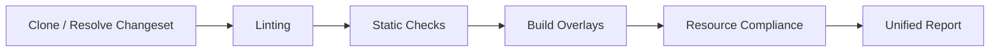

# Architecture

This is the top-level entry point for understanding how `k8s-gitops-ci`
fits together. `docs/DEVELOPMENT.md` covers build/test/lint commands and
the design conventions that keep this a generic, org-agnostic core; this
document covers the runtime shape: what actually happens when you run a
pipeline, and where to look for each piece.

## Overview

`k8s-gitops-ci` is a single Go binary that replaces a multi-task Tekton
pipeline with one process: clone/resolve a changeset, lint it, build the
Kustomize overlays it affects, run a registry-driven set of Kubernetes
resource-compliance checks, and post (or print) one unified report.

- **Clone / Resolve Changeset** — `pkg/git`/`pkg/github` clone the repo
  and resolve the PR's changed-file list (or, for `test-all`, every file
  under given directories; or, for `scan-all`, the current working
  tree's uncommitted git diff — see [CI.md](CI.md)'s Modes table for the
  exact, non-obvious semantics of each); `pkg/changeset` filters that
  list by path prefix (`--dirs`) and extension.
- **Linting** and **Static Checks** — a fixed set of independent,
  concurrently-run steps over the changeset (see [CI.md](CI.md) for the
  full list). Neither phase touches Kubernetes semantics; they're
  generic file-level checks (Markdown/YAML formatting, shell linting,
  Go linting, schema validation, large-file guards, ...).
- **Build Overlays** — `overlay.RenderKustomize` builds every Kustomize
  overlay affected by the changeset (via `detectOverlaysForChanges`,
  which is app-aware, not a bare `overlays/` path-segment match — see
  below) using the native Kustomize SDK, no `kustomize` binary required.
  This rendered output feeds kubeconform (schema validation) and
  ghost-patch detection.

  > **Not yet wired:** `pkg/overlay`'s `BuildOptions`/`RunBuildLoop`/
  > `Strategy` API additionally implements Helm chart rendering and an
  > `argocd-vault-plugin`-piped variant of both Kustomize and Helm
  > (`StrategyKustomizeAVP`/`StrategyHelmAVP`, which shells out to
  > `argocd-vault-plugin generate -` to resolve `<path:...>`/`<vault:...>`/
  > etc. placeholders the way ArgoCD's AVP plugin does at sync time). This
  > is real, implemented, unit-tested code — but no current CLI flag or
  > pipeline phase actually selects it; every real call site
  > (`pkg/validator/build_wiring.go`, `pkg/validator/kubeconform_overlay.go`,
  > `pkg/ghostpatch/ghostpatch.go`) calls `RenderKustomize` directly. Don't
  > assume AVP/Helm rendering happens today just because the code exists to
  > do it — this is a prepared-but-unwired capability, the same class of
  > gap as the Kyverno step noted below.

- **Resource Compliance** — the registry-driven check engine
  (`pkg/validator/check`) runs every registered `check.Check` over every
  changed YAML document (`check.ScopeDoc`) or every affected overlay
  (`check.ScopeOverlay`), then classifies findings as blocking (the
  offending file was itself changed) vs. warning-only (the file was only
  pulled in because a shared base/component it depends on changed
  elsewhere) — see [CI.md](CI.md) for the full check list and the exact
  classification rule, which is reused for the shellcheck extraction
  findings described there too.
- **Unified Report** — one PR comment (or, without `--comment`, console
  output) assembled from every phase's `Section`s. See
  [CI.md](CI.md) for the report structure.

## Why "app-aware" overlay detection matters

A naive "does the changed path contain `overlays/`" check misses the
common case of a shared `base/` or `components/<name>/<version>/` change
that doesn't touch `overlays/` at all but still needs every dependent
overlay rebuilt and re-checked. `detectOverlaysForChanges`
(`pkg/validator/build_wiring.go`) instead: finds each touched app root,
asks `overlay.GetOverlaysToTest` what a change under that root implies
(cluster-specific vs. every overlay via a base/component change), and for
the latter narrows that down further via `overlay.FilterOverlaysByRefs`
(which parses each overlay's Kustomize `resources`/`components`/`bases`
reference chain via `kustomize.ResolveRefs`) so only overlays that
actually reference the changed component version are affected. This is
the same machinery the direct-vs-external classification above depends
on.

## Package map

See `docs/DEVELOPMENT.md`'s [Repository Structure](DEVELOPMENT.md#repository-structure)
for the authoritative directory tree with one-line descriptions. In terms
of the flow above:

- **Changeset resolution:** `pkg/changeset`, `pkg/git`, `pkg/github`.
- **Linting/Static Checks:** `pkg/lint/*` (one package per external tool)
  plus a few in-repo checks (`pkg/largefile`, `pkg/lint/yamlsyntax`,
  `pkg/config`, `pkg/csv`) driven from `pkg/validator/phases.go`.
- **Build Overlays:** `pkg/overlay`, `pkg/kustomize`, `pkg/ghostpatch`,
  `pkg/scaffold`.
- **Resource Compliance:** `pkg/validator/check` (the registry engine),
  `pkg/validator/exempt` (the unified exemption framework — see
  [EXCEPTIONS.md](EXCEPTIONS.md)), and one package per validator
  (`namespace`, `psa`, `rbac`, `crb`, `syncopts`, `image`, `namedport`,
  `podspec`, `placeholder`, `clusterid`).
- **NetworkAttachmentDefinition validation:** `pkg/validator/nad` — a
  separate, always-on, non-exemptable validator over rendered overlay
  output (not part of the `check.Register` framework above; see
  [CI.md](CI.md#networkattachmentdefinition-nad-validation)).
- **Reporting:** `pkg/validator/unified_report.go`,
  `compose_sections.go`, `pkg/logger`.
- **Org-injection seams:** `pkg/provider` (see Design Conventions below).
- **Orchestration:** `pkg/pipeline` (top-level PR-check flow, wired from
  `cmd/k8s-gitops-ci`), `pkg/validator` (the `RunAll`/phases engine
  `pipeline` calls into).

## Design conventions (link, not duplicate)

`docs/DEVELOPMENT.md`'s
[Design Conventions](DEVELOPMENT.md#design-conventions) section is the
canonical reference for:

- The **Options-struct pattern** (`validator.Options`, `pipeline.Options`,
  `overlay.BuildOptions`, ...).
- The **`provider.Providers` seam** — runtime-injected org behavior
  (branding, comment-marker cleanup policy, secret-backend auth hints,
  cluster/project identity).
- **Exported override vars** — compile-time org data injection (e.g.
  `pkg/lint/kyverno`'s `ExcludedRules`, `pkg/validator`'s `TektonPACDir`).
- The **"core data + org-injectable override"** map pattern (e.g.
  `pkg/validator/namespace`'s resource-scope maps).
- The **generic check-enablement mechanism**
  (`Options.DisabledChecks`/`EnabledChecks` + `stepEnabled`/
  `defaultOffSteps` in `pkg/validator/phases.go`).

## Where do I find X?

| Looking for...                                                                 | See                              |
| ------------------------------------------------------------------------------ | -------------------------------- |
| Full list of checks/steps, pipeline phases, report structure                   | [CI.md](CI.md)                   |
| `test.sh` hook contract, `PRE_BUILD_HOOK`/etc. current status                  | [HOOKS.md](HOOKS.md)             |
| Annotation vs. `EXEMPTIONS` selector exemptions, adding a new exemptable check | [EXCEPTIONS.md](EXCEPTIONS.md)   |
| Tekton pipeline/task layout, PaC triggers, build-step script                   | [TEKTON.md](TEKTON.md)           |
| Versioning, changelog, release artifacts                                       | [RELEASE.md](RELEASE.md)         |
| Trust model, `exec.Command` audit, file-permission rationale                   | [SECURITY.md](SECURITY.md)       |
| Embedded kubeconform schemas / Kyverno policies, how an org supplies its own   | [SCHEMAS.md](SCHEMAS.md)         |
| Build/test/lint commands, repo structure, design conventions                   | [DEVELOPMENT.md](DEVELOPMENT.md) |
