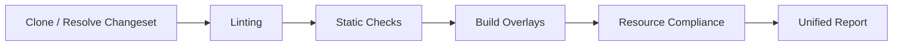

# Architecture

This is the top-level entry point for understanding how `k8s-gitops-ci`
fits together. `docs/DEVELOPMENT.md` covers build/test/lint commands and
the design conventions that keep this a generic, org-agnostic core; this
document covers the runtime shape: what actually happens when you run a
pipeline, and where to look for each piece.

## Table of Contents

- [Overview](#overview)
- [Why "app-aware" overlay detection matters](#why-app-aware-overlay-detection-matters)
- [Package map](#package-map)
- [Design conventions (link, not duplicate)](#design-conventions-link-not-duplicate)
- [Future Simplifications](#future-simplifications)
- [Where do I find X?](#where-do-i-find-x)

## Overview

`k8s-gitops-ci` is a single Go binary that replaces a multi-task Tekton
pipeline with one process: clone/resolve a changeset, lint it, build the
Kustomize overlays it affects, run a registry-driven set of Kubernetes
resource-compliance checks, and post (or print) one unified report.

- **Clone / Resolve Changeset** — `pkg/git`/`pkg/github` clone the repo
  and resolve the PR's changed-file list (or, for `test`/`--dirs`,
  every file under the given directories, replacing the diff entirely;
  or, for `test` with no arguments, the current working tree's uncommitted git diff —
  see [CI.md](CI.md)'s Modes table for the exact, non-obvious semantics
  of each); `pkg/changeset` narrows that list by extension.
- **Linting** and **Static Checks** — a fixed set of independent,
  concurrently-run steps over the changeset (see [CI.md](CI.md) for the
  full list). Neither phase touches Kubernetes semantics; they're
  generic file-level checks (Markdown/YAML formatting, shell linting,
  Go linting, schema validation, large-file guards, ...).
- **Build Overlays** — `overlay.RenderKustomize` builds every Kustomize
  overlay affected by the changeset (via `detectOverlaysForChanges`,
  which is app-aware, not a bare `overlays/` path-segment match — see
  below) using the native Kustomize SDK, no `kustomize` binary required.
  This rendered output feeds kubeconform (schema validation) and
  ghost-patch detection.

  > **Not yet wired:** `pkg/overlay`'s `BuildOptions`/`RunBuildLoop`/
  > `Strategy` API additionally implements Helm chart rendering and an
  > `argocd-vault-plugin`-piped variant of both Kustomize and Helm
  > (`StrategyKustomizeAVP`/`StrategyHelmAVP`, which shells out to
  > `argocd-vault-plugin generate -` to resolve `<path:...>`/`<vault:...>`/
  > etc. placeholders the way ArgoCD's AVP plugin does at sync time). This
  > is real, implemented, unit-tested code — but no current CLI flag or
  > pipeline phase actually selects it; every real call site
  > (`pkg/validator/build_wiring.go`,
  > `pkg/validator/hook_wiring.go`, `pkg/ghostpatch/ghostpatch.go`) calls
  > `RenderKustomize` directly. Don't
  > assume AVP/Helm rendering happens today just because the code exists to
  > do it — this is a prepared-but-unwired capability, the same class of
  > gap as the Kyverno step noted below.

- **Resource Compliance** — the registry-driven check engine
  (`pkg/validator/check`) runs every registered `check.Check` over every
  changed YAML document (`check.ScopeDoc`) or every affected overlay
  (`check.ScopeOverlay`). Render-sensitive doc checks are judged on the
  kustomize/AVP-**rendered** overlay output (with a raw-source fallback),
  and findings are classified as blocking (the offending resource was
  itself changed) vs. warning-only (pulled in only because a shared
  base/component it depends on changed elsewhere) — see [CI.md](CI.md) for
  the full check list, the raw-vs-rendered dual-pass model, and the exact
  classification rule, which is reused for the shellcheck extraction
  findings described there too.
- **Unified Report** — one PR comment (or, without `--comment`, console
  output) assembled from every phase's `ReportSection`s. See
  [CI.md](CI.md) for the report structure.

## Why "app-aware" overlay detection matters

A naive "does the changed path contain `overlays/`" check misses the
common case of a shared `base/` or `components/<name>/<version>/` change
that doesn't touch `overlays/` at all but still needs every dependent
overlay rebuilt and re-checked. `detectOverlaysForChanges`
(`pkg/validator/build_wiring.go`) instead: finds each touched app root,
asks `overlay.GetOverlaysToTest` what a change under that root implies
(cluster-specific vs. every overlay via a base/component change), and for
the latter narrows that down further via `overlay.FilterOverlaysByRefs`
(which parses each overlay's Kustomize `resources`/`components`/`bases`
reference chain via `kustomize.ResolveRefs`) so only overlays that
actually reference the changed component version are affected. This is
the same machinery the direct-vs-external classification above depends
on.

## Package map

See `docs/DEVELOPMENT.md`'s [Repository Structure](DEVELOPMENT.md#repository-structure)
for the authoritative directory tree with one-line descriptions. In terms
of the flow above:

- **Changeset resolution:** `pkg/changeset`, `pkg/git`, `pkg/github`.
- **Linting/Static Checks:** `pkg/lint/*` (one package per external tool)
  plus a few in-repo checks (`pkg/largefile`, `pkg/lint/yamlsyntax`,
  `pkg/config`, `pkg/csv`) driven from `pkg/validator/phases.go`.
- **Build Overlays:** `pkg/overlay`, `pkg/kustomize`, `pkg/ghostpatch`,
  `pkg/scaffold`.
- **Resource Compliance:** `pkg/validator/check` (the registry engine),
  `pkg/validator/exempt` (the unified exemption framework — see
  [EXEMPTIONS.md](EXEMPTIONS.md)), and one package per validator
  (`namespace`, `psa`, `rbac`, `crb`, `syncopts`, `image`, `namedport`,
  `podspec`, `placeholder`, `clusterid`).
- **Runtime Validation (admission rules):**
  `pkg/validator/runtime` (shared `Check`/`Finding` types and the adapter
  onto `check.Check`) and
  `pkg/validator/runtime/kubernetes/<apigroup>` (one
  subpackage per Kubernetes API group: `admissionregistration`,
  `apiextensions`, `apps`, `autoscaling`, `batch`, `core`, `networking`,
  `policy`, `rbac`, `storage`). These are 1:1 ports of the
  API server's own validation logic (upstream's
  `k8s.io/kubernetes/pkg/apis/*/validation`, which isn't importable as a
  library), so they only fire on manifests the cluster would reject.
  They render as their own **"Runtime Validation"** report section and
  are **always blocking and non-exemptable** (`check.NonExemptable`) —
  see [CI.md](CI.md#runtime-validation-checks-admission-rules) and
  [EXEMPTIONS.md](EXEMPTIONS.md#runtime-validation-ids-are-never-exemptable).
- **NetworkAttachmentDefinition validation:** splits by whether a rule is
  citable to a specific upstream function. `pkg/validator/static/nad` — non-blocking
  advisories for likely authoring mistakes, which correspond to no upstream
  function — is a separate, always-on validator over rendered overlay
  output, not part of the `check.Register` framework above; its report
  section is rendered only when a NAD is present in the chain. It reports
  no hard failures: whether a `spec.config` parses at all is decided by
  `pkg/validator/runtime/k8scni`'s `k8scni/net-attach-def/config-invalid`
  check, and OVN's own semantic rules by
  `k8scni/net-attach-def/ovn-netconf-invalid` — both citable, so both belong to
  the Runtime Validation family (see
  [CI.md](CI.md#networkattachmentdefinition-nad-validation)). The blocking
  logic for NADs lives there, not here.
- **Reporting:** `pkg/validator/unified_report.go`,
  `compose_sections.go`, `pkg/logger`.
- **Org-injection seams:** `pkg/provider` (see Design Conventions below).
- **Orchestration:** `pkg/pipeline` (top-level PR-check flow, wired from
  `cmd/k8s-gitops-ci`), `pkg/validator` (the `RunAll`/phases engine
  `pipeline` calls into).

## Design conventions (link, not duplicate)

`docs/DEVELOPMENT.md`'s
[Design Conventions](DEVELOPMENT.md#design-conventions) section is the
canonical reference for:

- The **Options-struct pattern** (`validator.Options`, `pipeline.Options`,
  `overlay.BuildOptions`, ...).
- The **`provider.Providers` seam** — runtime-injected org behavior
  (branding, comment-marker cleanup policy, secret-backend auth hints,
  cluster/project identity).
- **Exported override vars** — compile-time org data injection (e.g.
  `pkg/lint/kyverno`'s `ExcludedRules`, `pkg/validator`'s `TektonPACDir`).
- The **"core data + org-injectable override"** map pattern (e.g.
  `pkg/validator/static/namespace`'s resource-scope maps).
- The **generic check-enablement mechanism**
  (`Options.DisabledChecks`/`EnabledChecks` + `stepEnabled`/
  `defaultOffSteps` in `pkg/validator/phases.go`).
- **Shared type consolidation** — types shared across multiple internal
  wiring files (`overlayRef`, `renderedOverlay`, `hookOutcome`,
  `appHookResult`, `appBuildStrategy`, `mergeHookOutcome`) are defined
  once in `pkg/validator/types.go` and imported by callers, preventing
  duplicated struct definitions and keeping the internal API surface
  stable.

## Future Simplifications

The `pkg/validator/` directory currently holds the central orchestration
(`phases.go`, ~1100 lines), the wiring layer (`build_wiring.go`,
`hook_wiring.go`, `target_wiring.go`, `scaffold_wiring.go`, `kyverno_wiring.go`,
`avp_wiring.go`, `nad_wiring.go`, `nonapp_wiring.go`, `dispatch.go`,
`overlay_discovery.go`, `kubeconform_overlay.go`), and the centralized
shared types (`types.go`). This structure has been validated by
consolidation — `engine.go` was merged into `phases.go`, and wiring files
are kept flat to avoid import cycles.

The directory could be split further in the future if file counts or line
counts make editing or review overhead noticeable. The path forward
requires resolving two dependencies:

1. **Export shared types.** The wiring layer and phases both depend on
   internal types (`renderedOverlay`, `hookOutcome`, etc.) defined in
   `types.go`. To extract `wiring/` and `engine/` (or `phases/`) as
   sibling packages, these types must be promoted to a shared sub-package
   (e.g. `pkg/validator/types`) so that `wiring`, `phases`, and `check`
   can all import them without creating a cycle (`validator` ↔ `wiring`).
2. **Decouple test imports.** Several tests in `phases_test.go` and
   `*_wiring_test.go` depend on unexported package-level state
   (`RunAll`'s side-effects, `hookBuildRoot`, `DefaultEnabledChecks`).
   Extracting sub-packages would require converting these to explicit
   dependency injection or test helpers that reset state between runs,
   so each sub-package's tests can run independently without importing
   the parent package's internals.

If/when these prerequisites are met, the suggested extraction order is:

- `pkg/validator/types` — shared structs driving the consolidation.
- `pkg/validator/wiring` — overlay discovery, hook execution, and
  check-target resolution logic (currently flat in `build_wiring.go`,
  `hook_wiring.go`, `target_wiring.go`, etc.).
- `pkg/validator/engine` — the per-overlay build loop and compliance
  fan-out (historically `engine.go`, now merged into `phases.go`).
- `pkg/validator/phases.go` — top-level phase orchestration (linting,
  static checks, build orchestration, reporting assembly).

Until those structural dependencies are resolved, the current flat
layout under `pkg/validator/` is the intentional default — it keeps
imports simple, avoids circular dependencies, and remains within
maintainable file-size bounds.

## Where do I find X?

| Looking for...                                                                 | See                                                        |
| ------------------------------------------------------------------------------ | ---------------------------------------------------------- |
| Full list of checks/steps, pipeline phases, report structure                   | [CI.md](CI.md)                                             |
| Runtime validation (`pkg/validator/runtime/`), and why it's non-exemptable     | [CI.md](CI.md#runtime-validation-checks-admission-rules)   |
| Why enum/range/format rules can't come from the embedded schemas               | [SCHEMAS.md](SCHEMAS.md#runtime-validation-vs-kubeconform) |
| `test.sh` hook contract, `PRE_BUILD_HOOK`/etc. current status                  | [HOOKS.md](HOOKS.md)                                       |
| Annotation vs. `EXEMPTIONS` selector exemptions, adding a new exemptable check | [EXEMPTIONS.md](EXEMPTIONS.md)                             |
| Tekton pipeline/task layout, PaC triggers, build-step script                   | [TEKTON.md](TEKTON.md)                                     |
| Versioning (`VERSION` file), releases & RCs, release artifacts                 | [RELEASE.md](RELEASE.md)                                   |
| Trust model, `exec.Command` audit, file-permission rationale                   | [SECURITY.md](SECURITY.md)                                 |
| Embedded kubeconform schemas / Kyverno policies, how an org supplies its own   | [SCHEMAS.md](SCHEMAS.md)                                   |
| Build/test/lint commands, repo structure, design conventions                   | [DEVELOPMENT.md](DEVELOPMENT.md)                           |
