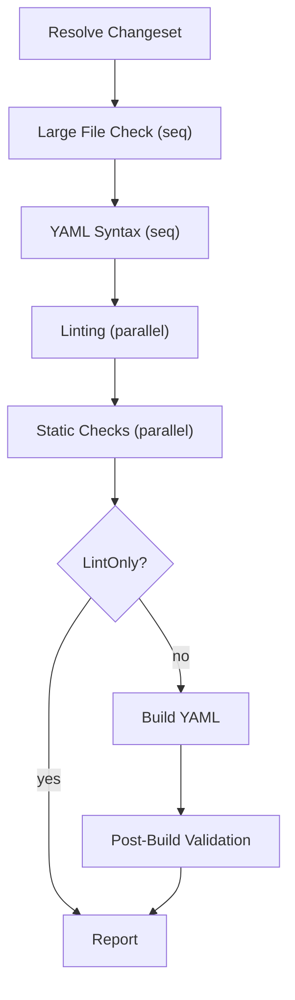

# CI Pipeline

This document describes what `k8s-gitops-ci pipeline`/`ci` (and the
standalone subcommands) actually do today. See
[ARCHITECTURE.md](ARCHITECTURE.md) for the one-paragraph overview and
package map; this is the detailed, step-by-step reference.

## Table of Contents

- [CI Pipeline](#ci-pipeline)
  - [Table of Contents](#table-of-contents)
  - [Pipeline Flow](#pipeline-flow)
  - [Modes](#modes)
  - [Build Strategies](#build-strategies)
  - [Validation Steps](#validation-steps)
    - [Linting phase (all steps run concurrently)](#linting-phase-all-steps-run-concurrently)
      - [`markdownlint`](#markdownlint)
      - [`prettier`](#prettier)
      - [`golangci`](#golangci)
      - [`kubeconform`](#kubeconform)
      - [`shellcheck`](#shellcheck)
    - [Static Checks phase (all steps run concurrently)](#static-checks-phase-all-steps-run-concurrently)
      - [`large-file`](#large-file)
      - [`YAML-syntax`](#yaml-syntax)
      - [`config-sort`](#config-sort)
      - [`startingCSV`](#startingcsv)
      - [`scaffold-readme`](#scaffold-readme)
    - [Kustomize Fix](#kustomize-fix)
    - [Ghost Patch Detection](#ghost-patch-detection)
    - [Scaffold Validation](#scaffold-validation)
    - [Registered checks](#registered-checks)
      - [Runtime validation checks (admission rules)](#runtime-validation-checks-admission-rules)
        - [Every check must cite a verifiable upstream function](#every-check-must-cite-a-verifiable-upstream-function)
        - [Version skew and feature gates (known limitation)](#version-skew-and-feature-gates-known-limitation)
        - [Cite the set when the set decides acceptance](#cite-the-set-when-the-set-decides-acceptance)
        - [What the citation does not prove: `Note`](#what-the-citation-does-not-prove-note)
        - [Dispatch owns kind filtering](#dispatch-owns-kind-filtering)
        - [Object name validation](#object-name-validation)
        - [Known gaps: upstream rules not yet ported](#known-gaps-upstream-rules-not-yet-ported)
        - [Deferred: policy-style checks removed from this family](#deferred-policy-style-checks-removed-from-this-family)
      - [Raw vs. rendered check input (dual-pass compliance)](#raw-vs-rendered-check-input-dual-pass-compliance)
      - [`namespace`](#namespace)
      - [`psa-labels`](#psa-labels)
      - [`rbac-readonly`](#rbac-readonly)
      - [`rbac-wildcards`](#rbac-wildcards)
      - [`crb`](#crb)
      - [`sync-options`](#sync-options)
      - [`image-checksum`](#image-checksum)
      - [`image-fqdn`](#image-fqdn)
      - [`named-ports`](#named-ports)
      - [`podspec-defaults`](#podspec-defaults)
      - [`placeholder`](#placeholder)
      - [`cluster-identity`](#cluster-identity)
      - [`avp`](#avp)
      - [`kyverno`](#kyverno)
    - [NetworkAttachmentDefinition (NAD) validation](#networkattachmentdefinition-nad-validation)
  - [Direct vs. external findings](#direct-vs-external-findings)
  - [Concurrency](#concurrency)
  - [Report structure](#report-structure)

## Pipeline Flow

`pkg/validator/phases.go`'s `RunAll` runs four or six phases, in order:



- **Large File Check** and **YAML Syntax** each run as their own standalone,
  sequential phase (single check, no goroutine fan-out needed) before
  Linting - matching a downstream fork's equivalent phase breakdown (see
  the timing-table example in [DEVELOPMENT.md](DEVELOPMENT.md)). Both still
  feed the same `ReportSection`/PR-comment rendering as every other Static
  Checks sub-check (`ComposeStaticChecksSection`'s fixed 5-check order) -
  only the live console/timing-table grouping differs.
- **Linting** and **Static Checks** (the remaining config-sort/startingCSV/
  scaffold-table checks) each fan every one of their steps out across
  goroutines (bounded by `Workers(opts)` — see [Concurrency](#concurrency)
  below) rather than running sequentially; every step still gets recorded
  (pass/fail/skip) in the report even when it found nothing wrong, so a
  linter never silently disappears from the output.
- **Build YAML** and **Post-Build Validation** together only run unless
  `--lint-only` is passed. Build YAML resolves the affected overlay set
  (`detectOverlaysForChanges` — see [ARCHITECTURE.md](ARCHITECTURE.md)),
  runs Scaffold Validation, and builds every overlay (via a bounded
  per-overlay worker pool, plus a per-app "Building: `<name>`" console
  summary banner printed once all of that app's overlays finish building).
  Post-Build Validation then runs the doc-scoped and overlay-scoped checks
  (see [Registered checks](#registered-checks) below - the overlay-scoped
  pass itself actually executes inside Build YAML's worker-pool loop,
  alongside the build, since neither depends on the other's result within
  one overlay's iteration), Kyverno, and NAD validation, and classifies
  every finding as blocking (direct) or warning-only (external) — see
  [Direct vs. external findings](#direct-vs-external-findings).

## Modes

| Mode                 | Command                                                            | Changeset source                                                                                                                                                                                                         |
| -------------------- | ------------------------------------------------------------------ | ------------------------------------------------------------------------------------------------------------------------------------------------------------------------------------------------------------------------ |
| Full pipeline        | `k8s-gitops-ci pipeline --url <repo> --pr <n>` (alias: `ci`)       | PR's changed files via the GitHub API                                                                                                                                                                                    |
| Local PR check       | `k8s-gitops-ci pipeline --revision <sha> --target-branch <branch>` | `git diff <target>...<revision>`                                                                                                                                                                                         |
| Full repo scan       | `k8s-gitops-ci test --all`                                         | **every file on disk**, every overlay — ignores git state entirely (see `--all` below)                                                                                                                                   |
| Directory scan       | `k8s-gitops-ci test [dirs...]` or `test --dirs kubernetes/`        | every file under the given positional directories (not a diff — the full tree under each path); with no positional dirs or `--dirs`, falls back to the same changeset resolution as `pipeline` (working-tree `git diff`) |
| Working-tree diff    | `k8s-gitops-ci test` (no args)                                     | **`git diff` + `git diff --cached`** in the current working tree — uncommitted changes only                                                                                                                              |
| Ad-hoc overlay build | `k8s-gitops-ci build-yaml --app <app> --cluster <cluster>`         | Targeted, git-independent: the given app(s)/cluster(s)' `base/` + matching `overlays/<cluster>` directories only — see `--app`/`--cluster` below.                                                                        |

`test` accepts the same changeset-scoping and
check-enablement flags as `pipeline` — `--url`/`--pr`/`--target-branch`
(PR/diff source), `--dirs` (a full-tree walk of exactly the given path
prefixes, replacing the diff/PR-derived changeset entirely — the same
underlying behavior as `test`'s positional `[dirs...]`; when
`test` is given both, the positional args take precedence),
`--disable-checks`/`--enable-checks`, `--hook-source`, `--concurrency`,
`--assume-openshift`, and `--app`/`--cluster` (below). This lets a
failing `pipeline --url ... --pr ...` run be reproduced locally with
`test` using an equivalent flag set.

**`--all`** — Full repository scan. Walks every file on disk (respecting
the same `ExtraNonAppDirs` and scaffold template exclusions as overlay
discovery) and builds every overlay in the repository. Ignores git state
entirely. Takes priority over `--dirs` when both are set. This is
useful for a 100% repo-wide validation run — `test --all --lint-only`
for linting everything without overlay rendering, `test --all` for
everything including overlay builds and Post-Build Validation.

**`--quiet`** — Quiet output. Only prints failed/warned sections' full
detail; passing sections are suppressed entirely (no one-line summary).
Always exits 0, regardless of findings. This is useful for pre-commit
checks where you only want to see what you broke, not a full pass/fail
report.

**`--lint-only`** skips the Build Overlays + Resource Compliance phase
entirely — useful for a fast Linting/Static-Checks-only pass.

**`--app`/`--cluster` targeting** (`Options.Apps`/`Options.Clusters`,
repeatable flags) is resolved by `resolveTargetOverlays`
(`pkg/validator/target_wiring.go`) and takes priority over every other
changeset source (`Dirs`, diff-based resolution) when either is set —
entirely independent of git history/diffing, unlike every other mode:

- Both given: every `(app, cluster)` combination whose
  `overlays/<cluster>` directory actually exists on disk, plus that
  app's `base/`. A combination that doesn't exist on disk is silently
  skipped (not an error) so one typo in a multi-app/-cluster invocation
  doesn't abort the whole run; an app with none of the given clusters
  is skipped entirely.
- `--app` only: that app's entire directory (`base/` + every overlay).
- `--cluster` only: every app discovered in the repository (via
  `changeset.GetAllFiles` + the same app-root detection kubeconform
  validation uses) that has an `overlays/<cluster>` directory for one
  of the given cluster names.

An error is returned only if nothing resolves to anything on disk at
all (every value was a typo, or no app in the repo has a matching
cluster) — a silently-empty, always-passing run would be more
surprising than a hard failure here. (`pkg/scaffold.Run` takes its own,
unrelated per-app `RunOptions.App` — see
[Scaffold Validation](#scaffold-validation) below — driven entirely by
the resolved changeset, not `Options.Apps`/`Clusters`, so it's
unaffected either way.)

## Build Strategies

`pkg/validator/phases.go`'s Build YAML phase picks a
`pkg/overlay.Strategy` per app (`overlay.DetectStrategy`, wired via
`resolveAppBuildStrategies` in `pkg/validator/avp_wiring.go`) before
rendering any of that app's overlays:

- A `base/kustomization.yaml` → Kustomize, via the native Kustomize SDK
  (`sigs.k8s.io/kustomize/api/krusty`) — no runtime dependency on a
  `kustomize` binary. A `Chart.yaml` alongside it is still built via
  Kustomize (consumed through its own `helmCharts` inflator).
- No `kustomization.yaml` but a `base/Chart.yaml` → Helm, via the native
  chart loader + rendering engine (`helm.sh/helm/v3/pkg/...`) — no
  runtime dependency on a `helm` binary either, mirroring what
  `helm template` produces.
- Either way, if `DetectStrategy` finds an AVP indicator anywhere under
  the app (a direct `argocd-vault-plugin` reference, an
  `avp.kubernetes.io` annotation, or a `<path:...>`/`<vault:...>`/
  `<aws:...>`/`<gcp:...>` placeholder — see
  `overlay.AppHasAVPIndicators`), that overlay's rendered output is
  additionally piped through `argocd-vault-plugin generate -`, resolving
  those placeholders the way ArgoCD's real AVP plugin does at sync time
  — unless the overlay's basename is listed in that app's `test.sh`
  `AVP_EXCLUDE=` (`hook.Config.AVPExclude`, now actually read - see
  [HOOKS.md](HOOKS.md)).

The **`avp`** step ID (default **on**, same generic enable/disable
mechanism as every other step - see `Options.DisabledChecks`'s doc
comment) gates this entirely: `--disable-checks avp` forces every app's
Strategy back to plain Kustomize/Helm regardless of any AVP indicator
found, for an operator running without the `argocd-vault-plugin` binary
or a configured secret backend. See [`avp`](#avp) below for its own
subsection under Validation Steps.

Every real caller that needs a fully-rendered overlay - this phase's
build-error detection (`pkg/validator/hook_wiring.go`'s
`buildOverlayWithHooks`) - goes through this strategy-aware path
(`overlay.RenderWithStrategy`). One caller deliberately still renders
Kustomize-only, unconditionally, via `overlay.RenderKustomize` directly:
`pkg/ghostpatch/ghostpatch.go`'s patch-vs-base drift detection (structural,
unaffected by secret placeholders either way). kubeconform no longer renders
on its own at all - it consumes this phase's already-rendered, AVP-resolved
and Helm-inclusive output for its schema-validation pass (see "Kubeconform
(Rendered)" under Validation Steps), so it validates what actually deploys.
The `placeholder` check (registered with
`placeholder.Options{CheckAVP: false}`) deliberately does **not** flag
AVP-scheme tokens (`<path:...>`, `<vault:...>`, `<aws:...>`, `<gcp:...>`)
at all: it runs over the raw committed/changed source, where those
tokens are the intended, checked-in state — resolved at deploy time by
the real AVP plugin (or by this pipeline's own `overlay.RenderWithStrategy`
build described above), not by the author. `placeholder.Options.CheckAVP`
remains available for a caller that instead validates already-rendered
output, where a surviving AVP token _would_ be a real, unresolved
failure — this pipeline just isn't such a caller today.

## Validation Steps

Every step below is listed in the order its owning phase runs (see
[Pipeline Flow](#pipeline-flow) above): Linting, then Static Checks, then
Build YAML (Kustomize Fix, Ghost Patch Detection, Scaffold Validation),
then Post-Build Validation (Registered checks, NAD validation). Most
steps are gated by a stable string **check ID** via
`Options.DisabledChecks`/`EnabledChecks` (see `docs/DEVELOPMENT.md`'s
[Generic check-enablement
mechanism](DEVELOPMENT.md#generic-check-enablement-mechanism)) — each
such step is headed by that ID in backticks below. A few steps (Ghost
Patch Detection, Scaffold Validation's drift triggers, NAD validation)
have no check ID at all and always run.

### Linting phase (all steps run concurrently)

#### `markdownlint`

Lints changed `.md` files.

- **Package:** `pkg/lint/markdownlint`
- **Scope:** Only changed markdown files; skips cleanly (`Skipped: true`,
  `StatusPassed`) when there are none. GitHub issue/PR templates
  (`*_template.md`, `.github/*_template/`) are excluded — their first
  heading isn't required to be a single top-level `#` (it may be `##`,
  `###`, or deeper), so they do not have to follow markdownlint's heading
  conventions.
- **Default:** on. Like every CLI wrapper in this phase, a **missing
  `markdownlint-cli2` binary is a hard failure** (`StatusError`,
  blocking), not a graceful skip — a missing lint tool means the
  pipeline didn't actually check what it claims to have checked.
- **Disable:** `--disable-checks markdownlint` (for an environment that
  genuinely can't provision the tool).

#### `prettier`

Validates YAML formatting.

- **Package:** `pkg/lint/prettier`
- **Scope:** Only changed YAML files; skips cleanly when there are none.
- **Default:** on, same hard-fail-on-missing-CLI policy as
  [`markdownlint`](#markdownlint) above.
- **Disable:** `--disable-checks prettier`.

#### `golangci`

Checks Go file formatting and runs golangci-lint.

- **Package:** `pkg/lint/golangci`
- **Scope:** Only changed Go files; skips cleanly when there are none.
- **Default:** on, same hard-fail-on-missing-CLI policy as
  [`markdownlint`](#markdownlint) above.
- **Disable:** `--disable-checks golangci` (useful when linted separately
  in an image-build pipeline).

#### `kubeconform`

Schema-validation runs in two complementary passes:

- **Raw (Linting → Kubeconform):** changed YAML files that are **not** part of a
  scoped overlay's build chain are validated from source. Files inside an
  affected overlay (its overlay dir, its app `base/`, referenced components)
  are **excluded here** — they're schema-checked by the rendered pass below, so
  each changed manifest is validated by exactly one pass and a raw pass never
  trips over unresolved AVP placeholders.
- **Kubeconform (Rendered):** a post-build pass validates the overlays a PR
  actually affects — the change-scoped set the Build YAML phase resolves
  (`detectOverlaysForChanges`, so a base/component change resolves to just the
  overlays that reference it) — from the **already-rendered, AVP-resolved and
  Helm-inclusive** output the Build YAML phase produced. This validates what
  actually deploys (Helm charts rendered, AVP placeholders resolved), not raw
  source, and does so in a bounded worker pool (`validator.Workers`,
  `runtime.NumCPU()*2`). No overlay is re-rendered for kubeconform; it reuses
  the Build phase's render. Overlays that failed to build were already reported
  as build errors and simply aren't validated here.

Under `--lint-only` (no Build YAML phase), only the **raw** pass runs — there
is no rendered output to validate.

- **Package:** `pkg/lint/kubeconform`
- **Scaffold artifacts excluded:** files under `<ScaffoldDir>/configs/` and
  `<ScaffoldDir>/templates/` (see `convention.IsScaffoldArtifact`, where
  `ScaffoldDir` is `.scafctl` by default or an org override such as
  `.cldctl`) are the scaffolding CLI's own inputs — configs are not
  Kubernetes manifests (no `kind`/`apiVersion`) and templates are
  Go-templated source (often not valid standalone YAML). Both are skipped
  automatically by the kubeconform, doc-check, Kyverno, and YAML-syntax
  phases, so a changed scaffold config no longer trips a
  "missing 'kind' key" error. `<ScaffoldDir>/templates/` is likewise
  excluded from **overlay-build (app-root) discovery** (`detectAppRoots`),
  so a template subtree whose layout contains `overlays/<env>/` is never
  treated as a buildable kustomize overlay (which would otherwise fail
  with "unable to find kustomization.yaml"). Additional non-app path
  prefixes can be registered via `validator.ExtraNonAppDirs`, whose keys
  are matched on path-segment boundaries (a single-segment key like
  `vendor` excludes a top-level dir; a multi-segment key excludes a nested
  subtree).
- **Implementation:** a Go library, not a CLI wrapper — unlike the three
  checks above, there's no missing-binary case to gate.
- **Non-manifest YAML (content gate):** files validated on the **raw**
  path (flat directories that are _not_ kustomize/helm app roots) are
  first checked for a root-level `apiVersion`/`kind` (see
  `kubeconform.IsManifestYAML`). YAML that parses but has neither at the
  document root — e.g. an Ansible `inventory.yml` or an NMState network
  config living beside cluster manifests — is **skipped** rather than
  tripping a `missing 'kind' key` error. Detection is root-level only (a
  nested `kind:` in an Ansible/Helm value does not count) and keys solely
  on `apiVersion`/`kind` (not `metadata`/`data`/`spec`, which appear in
  non-manifests too). This applies **only to the raw path**: content
  rendered from a kustomize/helm app is always validated strictly, so a
  real manifest that loses its header inside an app still fails. Skips are
  surfaced as a non-blocking **ℹ️** note in the Linting → Kubeconform
  sub-check (and in `--dir`/standalone summary output) — never silent — so
  a genuinely header-less manifest in a flat directory stays visible for a
  human to catch. This is the content-aware complement to the
  unconditional `convention.KnownNonManifestFiles` basename fast-path (`Taskfile.yml`,
  `.golangci.yml`, …).
- **Default:** on. **Disable:** `--disable-checks kubeconform` — a genuine
  wholesale opt-out (unlike the CLI-wrapper checks above, there's no
  "binary not installed" reason to disable it; the reason here is usually
  "this changeset/repo can contain non-Kubernetes YAML the step can't
  meaningfully validate at all", e.g. a `--lint-only` run over a repo root
  that includes `Taskfile.yml`/`.golangci.yml`/etc.).
- **Exemptions:** for finer granularity than disabling the whole step,
  individual files can be skipped via
  `check=kubeconform,file=...`/`check=kubeconform,dir=...` selectors in a
  `test.sh` `EXEMPTIONS=(...)` block — see
  [EXEMPTIONS.md](EXEMPTIONS.md). Note that whole non-manifest YAML files
  on the raw path (no root `kind`/`apiVersion`) are now **auto-skipped** by
  the content gate above, so a selector is only needed when a file _is_ a
  manifest (or otherwise carries `kind`/`apiVersion`) but you deliberately
  want its schema check suppressed.

#### `shellcheck`

Wraps the raw `shellcheck` CLI over changed `.sh`/`.bash` files (or any
file whose shebang matches), **plus** extracts and lints:

- Bash steps embedded in Tekton `Task` manifests
  (`spec.steps[].script`, `pkg/lint/shellcheck/tekton.go`).
- Bash embedded in workload container/initContainer `command` fields
  (`[bash|sh, -c, <script>]` form) and ConfigMap `.sh`/`.bash` data
  keys (`pkg/lint/shellcheck/embedded.go`), across
  `Pod`/`Job`/`CronJob`/`Deployment`/`DaemonSet`/`StatefulSet`/
  `ReplicaSet` (`CronJob`'s pod spec is nested three levels deeper than
  every other kind, handled the same way `namedport`/`podspec` handle
  it). Non-bash scripts (python, plain `sh`, no shebang) are silently
  skipped — shellcheck only understands bash/sh/dash/ksh.

Extracted-script findings are classified **direct/blocking** (the
script's source YAML file was itself changed in this diff) vs.
**external/warning-only** (the file was only pulled into scope because
the overlay it lives in was affected by an unrelated base/component
change elsewhere), reusing the exact same file-set logic
(`externalOverlayYAMLFiles`, a directory walk over every overlay
`detectOverlaysForChanges` resolves, excluding files already in the
diff) as the identical direct/indirect split `finalizeCompliance`
applies to Resource Compliance findings (see
[Direct vs. external findings](#direct-vs-external-findings)). Raw `.sh`
file findings are always direct — they're literally files in the diff.

- **Package:** `pkg/lint/shellcheck`
- **Flags:** runs `shellcheck --format=gcc --enable=all --severity=style`. The
  `--enable=all` + `--severity=style` pair surfaces every optional check
  (style, info, warning, error) that default (`--severity=warning`, no
  `--enable`) silently filters out. Each parsed `Violation` carries
  shellcheck's own severity (as emitted, not normalized); the Linting phase's
  report lines themselves print `file:line: message`.
- **Default:** on. A missing `shellcheck` binary is a hard failure
  (`StatusError`, blocking) — but only once relevance is established:
  the "any shell-related file at all changed" short-circuit (no `.sh`
  files, no changed YAML at all) still runs first, so a changeset with
  nothing for shellcheck to check skips cleanly even with the CLI
  missing, rather than failing every unrelated PR in an environment
  that lacks it.
- **Disable:** `--disable-checks shellcheck`.

### Static Checks phase (all steps run concurrently)

#### `large-file`

Flags files over a size threshold, or that look binary.

- **Package:** `pkg/largefile`
- **Default max size:** `pkg/largefile.DefaultMaxSize`
- **Ignore patterns:** a generic ignore-glob allowlist
  (`pkg/largefile.DefaultIgnorePatterns` — compressed archives, web
  fonts, images/icons, and `customresourcedefinition*.yaml`, whose
  embedded OpenAPI schemas legitimately run large) is applied by
  default; override the var to add/replace entries.
- **Enablement:** always runs — not part of the
  `DisabledChecks`/`EnabledChecks` mechanism.

#### `YAML-syntax`

Parse-level YAML validity, independent of and cheaper than schema
validation.

- **Package:** `pkg/lint/yamlsyntax`
- **Enablement:** always runs — not gateable.

#### `config-sort`

Repo config files are alphabetically sorted.

- **Package:** `pkg/config` (`config.CheckSortOrder`)
- **Fix:** `k8s-gitops-ci sort-configs`
- **Enablement:** always runs — not gateable.

#### `startingCSV`

An OLM `ClusterServiceVersion`'s folder name matches its `startingCSV`
reference.

- **Package:** `pkg/csv`
- **Enablement:** always runs — not gateable.

#### `scaffold-readme`

A cheap, structural, per-PR check of the README's
`<!-- scaffold-status -->` table: does it list exactly the (app,
overlay) pairs that exist on disk today, with no missing or stale rows?

- **Package:** `pkg/scaffold` (`scaffold.CheckReadmeStatus`)
- **Report name:** renders as the **"scaffold table"** sub-check in the
  Static Checks section (not folded into
  [Scaffold Validation](#scaffold-validation)'s drift summary) — named
  to match `hintByCheck`'s key in `comments.go`, so a failure
  automatically gets an actionable fix-command hint the same way
  `config-sort`/`prettier`/`markdownlint` do.
- **Default: off.** Unlike every other step, this is opt-in
  (`--enable-checks scaffold-readme`) because this generic core can't
  know whether a given repo's table actually matches the
  one-row-per-app-per-overlay shape the check expects.
- **Fix:** `k8s-gitops-ci update-scaffold-status` — a full-repo-scan
  regeneration (`scaffold.UpdateReadmeStatus`) meant to be run
  deliberately, not on every PR. This check does **not** recompute
  actual drift itself (that would mean scaffolding every app in the
  repo on every PR) — the three real drift triggers live under
  [Scaffold Validation](#scaffold-validation) below and run
  independently of this check's enablement.

### Kustomize Fix

The "Kustomize Fix" sub-check in the Kustomize Build report section
(`kustomize.CheckFix`, wired via `runBuildAndPostBuild` in
`pkg/validator/phases.go`) detects `kustomization.yaml` files the real
`kustomize edit fix --vars` command would change. `pkg/kustomize` shells
out to the actual `kustomize` CLI rather than reimplementing its
field-ordering/deprecated-field-migration logic in Go: that logic
(preserve existing top-level field order; only append brand-new or
migrated fields - e.g. `vars:` -> `replacements:` - in one specific
order; never touch nested map ordering at all) is intricate and not a
stable public contract, and an earlier from-scratch reimplementation here
(a blanket alphabetical key sort) didn't actually match real kustomize
behavior at all. `CheckFix` never mutates the file it's checking - each
candidate is copied to a scratch temp directory and run through the real
fix pipeline there for comparison.

- **Package:** `pkg/kustomize`
- **Check ID:** `kustomize-fix`

**This is a hard dependency, not a graceful-degrade one**: a missing
`kustomize` or `prettier` binary fails the check outright rather than
silently skipping it - `kustomize` is a core, expected part of this
pipeline's toolchain, not an optional best-effort tool, so a run that
couldn't actually verify kustomization.yaml files must not report a
clean bill of health it never checked. A finding (or a check failure) is
blocking - `log.ErrorInSection` is called either way, so this is treated
exactly like any other hard failure (a run with only this finding still
exits non-zero from `pipeline`/`test`; see
[DEVELOPMENT.md](DEVELOPMENT.md#pipeline-exit-code-pipelinerun-resultfailed)).
It's gated behind the **`kustomize-fix`** step ID (default **on**, unlike
`kyverno`/`scaffold-readme`) purely so a repo (or a test) with no
`kustomize` binary available can opt out via `--disable-checks
kustomize-fix` instead of always hard-failing. Every `pkg/lint/*`
CLI-wrapping check in the [Linting phase](#linting-phase-all-steps-run-concurrently)
above (`markdownlint`, `prettier`, `shellcheck`, `golangci`) follows this
same hard-fail-not-graceful-skip philosophy and the same
gated-step-ID-for-opt-out pattern - `kustomize-fix` isn't a special case
here, it's the same convention applied to a check that isn't itself under
`pkg/lint/*`.

A follow-up `prettier --write` pass always runs after `kustomize edit fix`
on any file it actually changes: kustomize's own YAML writer doesn't
match this repo's prettier conventions (most visibly, it flattens
sequence-item indentation instead of indenting list items under their
parent key), so without the prettier pass a freshly "fixed" file would
immediately be re-flagged as needing a fix again.

`kustomize edit fix`'s own writer also unconditionally drops a leading
`---` YAML document-start marker, even though it's valid, optional YAML
and prettier's own `--write` pass neither strips nor restores it.
`runFixPipeline` (the same helper both `CheckFix` and `Fix` funnel
through) restores it after the `kustomize edit fix` call when the
original file had one, so `kustomize-fix` never silently strips a `---`
an operator had in their file - and never adds one to a file that never
had it either.

To actually apply the fix, use the standalone `kustomize-fix` CLI
subcommand, which does write the normalized file(s) back to disk (running
the same `kustomize edit fix --vars` + `prettier --write` pipeline):

```sh
k8s-gitops-ci kustomize-fix -dir <path>   # fix every kustomization.yaml under <path>, recursively
k8s-gitops-ci kustomize-fix -all          # fix every kustomization.yaml under the current directory, recursively
```

`-dir` and `-all` are mutually exclusive, and one of them is required -
running `kustomize-fix` with neither prints usage and exits non-zero
rather than silently doing nothing. The report's own "Kustomize Fix"
sub-dropdown includes a ready-to-run `kustomize-fix -dir` command per
affected directory, so a reviewer never has to construct one by hand.
`--vars` is always passed, so a deprecated `vars:` block is converted to
`replacements:` too - not just field/format normalization - matching
kustomize's own `edit fix --vars` help text, which recommends only doing
this in a clean git repository since it's a bigger, semantic
transformation than pure formatting.

### Ghost Patch Detection

Part of the Kustomize Build report section, `pkg/ghostpatch` detects a
"ghost patch" - a `kustomization.yaml` `patches` entry whose `target`
(kind/name/namespace) doesn't match any resource actually present in that
overlay's rendered output, almost always because the resource it was meant
to patch was renamed or removed elsewhere without updating (or removing)
the patch. Every detected ghost is always shown in the report's Ghost
Patches table, but only some are **blocking**
(`ghostpatch.ClassifyOverlay`/`ClassifyRendered`, wired via
`buildGhostTable` in `pkg/validator/build_wiring.go`):

- **Package:** `pkg/ghostpatch`
- **Enablement:** always runs — no check ID, not gateable.
- **Scope:** only the overlays this run actually built and rendered (the
  Build YAML phase's own `renderedOverlays`, see
  `runBuildAndPostBuild`/`buildOverlayWithHooks`) are classified -
  `ghostpatch.ClassifyRendered` never re-renders or discovers overlays on
  disk itself. An earlier version (`ghostpatch.ClassifyApp`, since removed)
  walked every overlay directory under each changed app and re-rendered
  each one via kustomize purely to check for ghosts; for an app with
  hundreds of overlays and a PR touching only a handful, that redundant
  full-app re-render dominated the Build YAML phase's wall time (minutes,
  for no benefit - see `docs/DEVELOPMENT.md`'s Timing table section) for
  detecting ghosts in overlays this PR never touched or built. A ghost on
  an overlay outside this run's changed/rendered set is simply never
  classified now - it isn't this run's concern, and the blocking rule
  below already only fires for a changed overlay's own
  `kustomization.yaml` anyway.

- **Blocking** - this PR changed the overlay's own `kustomization.yaml`
  (it is in the PR's changed-file set, resolved via `changeset` in
  `runBuildAndPostBuild`) **and** the file isn't itself newly added in
  this PR (per the changeset's added-files list, resolved once via
  `changeset.GetAddedFiles`). This is the case this PR most likely
  introduced or should have caught.
- **Warning-only** - either the overlay's `kustomization.yaml` isn't in
  this PR's changed-file set at all (the ghost predates this PR - visible
  for awareness, but not this PR's fault) or the `kustomization.yaml` is
  brand new in this PR (nothing shipped with it yet, so it can't be
  confidently attributed to a change this PR made).

The Kustomize Build section's own "Ghost Patches" sub-dropdown (one of four
always-shown children - Overlay Build, Hooks, Kustomize Fix, Ghost Patches

- composed via `composeGhostPatchesChild`/`composeParentFromChildren` in
  `pkg/validator/compose_sections.go`) mirrors this split: ❌ only when at
  least one detected ghost is blocking; a table with warning-only ghosts
  alone shows ⚠️ instead - the same ❌-blocking/⚠️-warning-only convention
  "Pre-Existing Scaffold Drift" and Resource Compliance use. Crucially, the
  parent "Kustomize Build" section's own icon inherits the _worst_ status
  among its four children (`composeParentFromChildren`), so a warning-only
  ghost patch rolls the whole section up to ⚠️ - never a misleading ✅ that
  would hide it, and never an overstated ❌.

### Scaffold Validation

Apps that opt into `scafctl`-based scaffolding (a `.scafctl/configs/<app>.yaml`
config exists - unrelated apps are skipped entirely, not treated as an
error) are re-validated against their scaffold template/config whenever a
change could affect their generated content
(`pkg/validator/scaffold_wiring.go`'s `runScaffoldValidation`, called from
the Build YAML phase).

- **Package:** `pkg/scaffold`
- **Enablement:** opt-out per app (`test.sh`'s `SCAFFOLD=false` — see
  [HOOKS.md](HOOKS.md)), not gated by a check ID. Apps without scaffold
  templates/config are never scaffold-tested regardless. The related,
  ID-gated README-table structural check is
  [`scaffold-readme`](#scaffold-readme) above — a separate, off-by-default
  check, not one of the three triggers below.

Three independent triggers, each skipping any app an earlier one already
tested, cover every way a change can require this:

1. **Template changes** (`configdiff.DetectTemplateChanges`) - a shared
   template changed, so every overlay of every app using it is
   re-checked (a full test).
2. **Config changes** (`configdiff.DetectAffectedApps`) - either specific
   clusters (an override changed) or a full test (a change that fans out
   cluster-independently, e.g. a changeGroup reassignment - see
   `provider.Providers.ChangeGroups`).
3. **An app's own overlay files changed**, not already covered above -
   only the overlays the PR actually touched, using the same trigger
   classification `overlay.GetOverlaysToTest` uses for the build phase
   itself.

`pkg/scaffold.Run` supports two drift-detection strategies, selected by the
`scaffold.DriftMode` package var (an org seam - default `DiffDirs`):

- **`DiffDirs`** (default, the `scafctl` contract): regenerate every overlay
  into a temp directory in one shot (`scafctl scaffold --config
<ConfigSource>=<path> --output <dir>`) and diff each committed overlay
  against it.
- **`DryRunParse`**: run the tool in dry-run mode (args built by the
  `scaffold.ScaffoldArgs` seam) and treat every file it reports it _would_
  create (`scaffold.ExtractCreatedFiles`, matching `scaffold.CreatedFileMarkers`)
  as evidence its overlay drifted. For tools whose dry-run output enumerates
  the files they would write rather than supporting the `--output`-to-dir
  contract `DiffDirs` assumes (e.g. a vendored `cldctl`). Preserves the same
  skip/mismatch classification (overlay exists → mismatch, deleted-by-PR →
  mismatch, not-yet-rolled-out cluster → skip) and `operatorOverlays` (full)
  vs. `clusterOverlays` (per-cluster, driven by `RunOptions.FullTest`) split.

For each app, `pkg/scaffold.Run` regenerates its overlays via the scaffold
tool once (bounded by a 2-minute timeout) and diffs the result against every
overlay actually being checked, **bounded-parallel** (up to
`runtime.NumCPU()*2` overlays at once - the per-app fan-out above is
similarly bounded-parallel across apps). An overlay is skipped rather
than failed when it's disabled - either explicitly
(`scaffoldDisabled: [...]` in the app's own scafctl config - see
`scaffold.IsOverlayDisabled`), via a `disabled: true` flag on its
override entry (`overlayDefinitions.overrides.<cluster>.disabled` - the
`scaffold.OverlayConfigDisabled` seam, whose generic default reads that
widely-used shape), or via change-group 0
(`scaffold.IsChangeGroupDisabled`) - or has no on-disk directory at all
(a cluster not yet rolled out, or removed by this PR;
`scaffold.Summary.SkippedClusters`, aggregated per app by
`runScaffoldValidation` and flattened by `flattenSkippedClusters` into the
Scaffold Validation section's "Cluster Coverage" sub-dropdown). A scafctl
execution failure is always treated as blocking. A content mismatch is
blocking when the PR itself touches the affected overlay (or a base/
component it inherits from - `isOverlayRelatedToChangedFiles`; the
overlay's own directory and the app's `base/` are coarse signals, but a
`components/<name>/<version>/` change only counts when that specific
overlay's kustomization reference chain actually includes the changed
version directory - resolved via `overlay.RefsChangedDir` over the
`kustomize.ResolveRefs` graph - so version-partitioned components
(`components/foo/v0.21.0` vs `components/foo/v0.19.1`) don't blame an
overlay pinned to a different, unaffected version); otherwise
it's checked against the merge-base template/config
(`computeBaselineMismatches`, gated on `Options.BaseRef` being set - i.e.
an actual CI/PR run, never a local `test` run against a live working
tree, which always has an empty `BaseRef`) and downgraded to a
non-blocking "Pre-Existing Scaffold Drift" entry (⚠️) when it mismatches
there too - this accounts for drift caused by something external to the
PR (e.g. a shared data source changing independently) rather than by the
PR's own edits. `computeBaselineMismatches` mutates the app's on-disk
template/config files in place for the duration of the re-run (backed up
and restored via `defer`, so a panic mid-run can never leave the working
tree altered) - a real but substantially riskier technique than a flat
"any drift blocks" policy, which is why it's reserved for exactly the
case it exists to fix rather than applied unconditionally. Missing
clusters themselves are **not** blocking, unlike drift/exec failures - a
skip is an expected, informational "here's what wasn't checked and why",
never a finding (see `scaffold.Run`'s own doc comment), so "Cluster
Coverage" renders as ℹ️ rather than ⚠️/❌ when clusters are skipped - a
deliberately quieter tier than an actual (non-blocking) warning like
"Pre-Existing Scaffold Drift", so a reader can tell "just FYI" apart from
"worth a second look."

Like Kustomize Build, the Scaffold Validation section itself is composed
from five always-shown sub-dropdowns (Scaffold Drift, Scaffold Exec,
Disabled Overlays, Pre-Existing Scaffold Drift, Cluster Coverage -
`ComposeScaffoldValidationSection`/`composeParentFromChildren` in
`pkg/validator/compose_sections.go`), and its own icon inherits the worst
status among them (StatusError > StatusWarning > StatusInfo >
StatusPassed) - so, for example, pre-existing drift alone rolls the whole
section up to ⚠️, and missing clusters alone rolls it up to only ℹ️, never
a misleading plain ✅ that would hide either.

A **config-disabled** overlay behaves differently from a merely-missing
one: when this PR **modifies** its files but the overlay is marked
`disabled: true` in its override entry, scaffolding is skipped (so a
nil-template/data error from the scaffold tool can't hard-fail a PR that
is only hand-editing a by-design-disabled overlay) and the overlay is
surfaced in the "Disabled Overlays" sub-dropdown as a ⚠️ **warning**
(`scaffold.OverlayConfigDisabled` → `runScaffoldValidation` filters
`Summary.DisabledClusters` to PR-touched overlays →
`composeDisabledOverlaysChild`). This is an "are you sure you meant to
edit a disabled overlay?" signal, never blocking: the pipeline still
passes, but the author is told to remove the `disabled: true` flag if
scaffolding was actually intended, or leave it as-is if the hand-edit is
intentional. A config-disabled overlay the PR does **not** touch is
skipped silently (only the informational Cluster Coverage list notes it),
matching the reserved-tone tiering above.

Separately, every app whose overlays or `.scafctl` template/config
changed is also checked for whether it has drift **coverage** at all:
`findUnprotectedApps` (`pkg/validator/scaffold_wiring.go`) flags any app
that has a scaffold template (so drift detection is actually available
for it) but has opted out via `SCAFFOLD=false` in its `test.sh` (see
[HOOKS.md](HOOKS.md)) - these apps are silently skipped by every trigger
above (`scaffold.HasScaffoldEnabled` gates all three), so a real drift
there would otherwise go completely unreported. This renders as its own
"Scaffold Drift Protection" report section, always present, non-blocking
(⚠️ StatusWarning - a coverage gap warning, not a drift finding - never
❌ StatusError, per `ComposeDriftProtectionSection`).

### Registered checks

Every check below is registered via `check.Register` in
`pkg/validator/register_checks.go` and, by that registration alone,
automatically exemptable via its own check ID (see
[EXEMPTIONS.md](EXEMPTIONS.md)) unless noted otherwise.

| ID                 | Package                     | Scope   | What it checks                                                                                                                                                                                                                                                                                                                                                                                                                                        |
| ------------------ | --------------------------- | ------- | ----------------------------------------------------------------------------------------------------------------------------------------------------------------------------------------------------------------------------------------------------------------------------------------------------------------------------------------------------------------------------------------------------------------------------------------------------- |
| `namespace`        | `pkg/validator/namespace`   | Doc     | Namespace-scoped resources declare `metadata.namespace`; cluster-scoped resources don't (except build-time-only Kustomize control objects)                                                                                                                                                                                                                                                                                                            |
| `psa-labels`       | `pkg/validator/psa`         | Doc     | Pod Security Admission namespace labels                                                                                                                                                                                                                                                                                                                                                                                                               |
| `rbac-readonly`    | `pkg/validator/rbac`        | Doc     | A `ClusterRole` carrying an aggregate-to-view/cluster-reader label only grants read-only verbs (with a narrow, exact-match allowlist for a handful of known exceptions)                                                                                                                                                                                                                                                                               |
| `rbac-wildcards`   | `pkg/validator/rbac`        | Doc     | No `"*"` in `verbs`/`resources`/`apiGroups` on `Role`/`ClusterRole`                                                                                                                                                                                                                                                                                                                                                                                   |
| `crb`              | `pkg/validator/crb`         | Doc     | `ClusterRoleBinding` subject namespace sanity                                                                                                                                                                                                                                                                                                                                                                                                         |
| `sync-options`     | `pkg/validator/syncopts`    | Doc     | Non-builtin API-group resources carry the ArgoCD `SkipDryRunOnMissingResource=true` sync-options annotation (builtin/core groups and OpenShift/OKD-exclusive API groups — e.g. `route.openshift.io`, `config.openshift.io` — are always exempt; OpenShift-_default_-but-portable groups that also ship on non-OpenShift clusters — e.g. Prometheus Operator, OLM, Gateway API, Multus/OVN-Kubernetes CNI — are only exempt with `--assume-openshift`) |
| `image-checksum`   | `pkg/validator/image`       | Doc     | Every OCI image reference is pinned to a `sha256:` digest, not just a tag                                                                                                                                                                                                                                                                                                                                                                             |
| `image-fqdn`       | `pkg/validator/image`       | Doc     | Every OCI image reference uses an explicit, fully-qualified registry host (no bare shortnames such as `nginx:latest`)                                                                                                                                                                                                                                                                                                                                 |
| `named-ports`      | `pkg/validator/namedport`   | Doc     | Container/Service ports are named, not numeric, everywhere they're referenced                                                                                                                                                                                                                                                                                                                                                                         |
| `podspec-defaults` | `pkg/validator/podspec`     | Doc     | Required pod-level fields (`enableServiceLinks`, `restartPolicy`, ...) and container `securityContext`/`resources.requests`/`resources.limits` are all set                                                                                                                                                                                                                                                                                            |
| `placeholder`      | `pkg/validator/placeholder` | Doc     | No unresolved `<PLACEHOLDER>`-style tokens or sentinel words (`CHANGEME`, `FIXME`, `XXX`, ...) left in committed YAML (AVP-scheme secret-reference tokens like `<path:...>` are deliberately not flagged — see below)                                                                                                                                                                                                                                 |
| `cluster-identity` | `pkg/validator/clusterid`   | Overlay | No copy/paste of another cluster's identity (cluster name, project ref) into this overlay — see `exempt.IDClusterName`/`IDProjectRef` (exemptable) vs. `exempt.IDClusterIdentity` (a deliberately non-exemptable structural bucket for findings that don't set a more specific ID)                                                                                                                                                                    |

#### Runtime validation checks (admission rules)

Runtime-validation checks are ports of the Kubernetes API server's own
validation logic — the `k8s.io/kubernetes/pkg/apis/*/validation` packages,
which upstream does not publish as an importable library. They catch
manifests the API server itself would reject at apply time: things
JSON-schema validation structurally cannot express (allowed values,
numeric ranges and signs, uniqueness, cross-field consistency, and string
formats such as DNS-1123 labels, qualified names, or cron syntax). See
[SCHEMAS.md](SCHEMAS.md#runtime-validation-vs-kubeconform) for why these
cannot come out of the schema pipeline instead.

They live under `pkg/validator/runtime/` (shared adapter and finding
types) and `pkg/validator/runtime/kubernetes/<apigroup>/` (the
checks themselves), and they render as their **own report section,
"Runtime Validation"** (`Section()` returns `"runtime-validation"`),
separate from Resource Compliance.

##### Check IDs are `<family>/<category>/<rule>`

A runtime check ID has three segments, for example
`kubernetes/batch/schedule-invalid`:

- **family** — the upstream project whose rejection the check mirrors.
  This is what makes the family prefix worth carrying: how strongly
  "the cluster rejects this" holds varies by upstream. A
  `kubernetes` rule is enforced by the API server and always holds; a
  rule owned by an operator only holds on clusters where that operator
  is installed.
- **category** — the grouping within that family, usually the API group
  or the kind the rule concerns (`batch`, `container`, `pod-spec`).
- **rule** — the rule itself.

Both `runtime.FamilyOf` and `runtime.CategoryOf` derive their answer from
the ID rather than reading a declared field, so the two can never
disagree with the identity findings are keyed by.

The report groups by family and then by category. The family level is
**omitted when only one family is present**, so a single-family run
renders exactly as it did before families existed rather than wrapping
the whole section in one redundant `<details>`.

Three properties distinguish this family from the registered checks
table above:

- **Always blocking, never exemptable.** A runtime finding describes a
  manifest the cluster rejects, so suppressing it would only defer the
  failure to apply time — the PR would go green and the sync would fail.
  The adapter implements the `check.NonExemptable` interface
  (`pkg/validator/check/check.go`), which makes `check.Register` skip its
  usual `exempt.RegisterExemptable` call, so no annotation and no
  `EXEMPTIONS=(...)` selector can match one. `TestRuntimeChecksAreNonExemptable`
  enforces this for every registered runtime check. See
  [EXEMPTIONS.md](EXEMPTIONS.md#exemptable-check-ids).

  This holds only while every family's rejection is **unconditional**,
  which is not the same as every family's rejection happening at the same
  moment:

  | Family       | Rejected by                   | When                 | Conditional on |
  | ------------ | ----------------------------- | -------------------- | -------------- |
  | `kubernetes` | the API server                | during admission     | nothing        |
  | `k8scni`     | the OVN-Kubernetes controller | just after admission | nothing        |

  Both are unconditional, so both can honestly be non-exemptable. A family
  whose rejection depends on something being installed — an operator's
  admission webhook, which rejects nothing on a cluster not running that
  operator — could not, and adding one means making `NonExemptable`
  per-check rather than widening what the constant already claims.

- **Kind-scoped by declaration.** Each check declares the kinds it
  applies to in its embedded `runtime.Meta`; the adapter inverts that
  applies-to list into the existing `check.DocSkipper` contract
  (`SkipDoc(kind) bool`), so a check is never handed a document kind it
  doesn't care about. An empty list means "every kind". The adapter is the
  only kind filter: most checks do not repeat the guard inside `Run`, and
  rely on never being handed the wrong kind. See
  [Dispatch owns kind filtering](#dispatch-owns-kind-filtering) for why
  that matters when calling a check directly.
- **Registration is asserted, not assumed.** Each `validation`
  sub-package registers its checks from an `init()`, pulled in by blank
  imports in `pkg/validator/runtime/kubernetes/register.go`.
  `TestEveryValidationPackageRegisters` asserts one representative check
  ID per sub-package is actually present in the registry. A package that
  is never imported, or imported without an `init()`, registers nothing
  and its checks simply never run — a failure that is invisible in a
  passing pipeline, since a check that never runs reports nothing.

**The standard for adding a new one: a runtime check must be a faithful
1:1 port of a specific upstream Kubernetes validation rule, or it does
not belong in this family.** "Always blocking, non-exemptable" is only
defensible if the cluster really would reject the manifest. Anything that
is merely a best practice — however good a practice — belongs in the
exemptable resource-compliance family in the table above instead.

Two failure modes disqualify a rule, and both are easy to write by
accident. A **fabricated** rule is one upstream has no equivalent for at
all. A **distorted** one is a real rule with materially wrong semantics:
the wrong validator (`IsDNS1123Subdomain` where upstream uses
`ValidateDNS1123Label`), the wrong field name, the wrong threshold, the
wrong enum, or a condition that can never fire. Neither is detectable by
reading the check in isolation, which is why the citation requirement
below is mandatory rather than advisory.

##### Every check must cite a verifiable upstream function

That standard is enforced, not merely stated. Each check supplies an
`UpstreamRef` in its package's `upstream_refs.go`:

```go
"kubernetes/apps/deployment-replicas-invalid": {
    Path:        "pkg/apis/apps/validation/validation.go",
    Functions:   []string{"ValidateDeploymentSpec"},
    Digest:      "sha256:...",
    ValidatedAt: "v1.37.0",
},
```

`runtime.RegisterAll` **panics** if a registered check has no valid ref, so
a check added without a citation fails on the first `go test` or binary
start. `Path` is relative to the root of `kubernetes/kubernetes` (`Repo`'s
default - see below), which lets refs into staging modules (apimachinery,
apiextensions-apiserver) use the same form as refs into `pkg/apis/*`.

Citing a **function**, not a file, is the point. A file path such as
`pkg/apis/core/validation/validation.go` is equally true of a faithful
port and of an invented rule — which is exactly how the fabricated checks
above survived review. Line numbers are forbidden outright: they drift on
every upstream release, and every incorrect citation in this repository's
history was a stale line range (one file cited `validation.go:5200-5210`
for a rule that actually lived some 3000 lines away).

Two layers verify this:

- **Offline, in `task ci`** — `TestEveryRuntimeCheckCitesUpstream` walks
  the registry and asserts every runtime check has a well-formed ref
  pointing at a Kubernetes API validation location. It walks the registry
  rather than scanning source because the admissionregistration checks
  compose their IDs at runtime, so no grep or AST pass can enumerate them.
- **Online, via `task verify:upstream-refs`** — fetches each cited file at
  the pinned tag and proves every cited function still exists and is
  unchanged. `Digest` is a hash of the cited functions' normalized source
  (comments and formatting stripped), so upstream documentation churn and
  gofmt changes are quiet while real logic changes fail. "Stripped" means
  the syntax tree only: the cited declarations are re-printed against an
  empty `FileSet`, so no position information from the source survives. That
  detail matters — printing against the parse `FileSet` leaves the blank line
  a dropped comment occupied, which made a doc-comment edit move the digest
  and would have failed every citation on releases that changed no logic.
  `internal/upstreamref` has unit tests asserting both halves: what must not
  move the digest (comments, blank lines, gofmt, declaration order, unrelated
  code) and what must (any change to a cited body or set, and a cited name
  disappearing). This runs as its
  own step in `task ci`. Fetched sources are cached under `XDG_CACHE_HOME`,
  so a warm run does no network I/O - the same pattern `schemas:pull`
  already uses.

###### Citing code outside kubernetes/kubernetes: `Repo` and `Kind`

Not every runtime check ports Kubernetes' own admission logic. A
NetworkAttachmentDefinition's OVN-Kubernetes semantic rules, for example,
are owned by a different upstream project entirely. Two fields on
`UpstreamRef` generalize the citation for that case without weakening it
for the 105 existing kubernetes/kubernetes refs, which are unaffected by
either field's default:

- **`Repo`** ("owner/name", default `kubernetes/kubernetes`) is the GitHub
  repository `Path` is relative to. `verify:upstream-refs` resolves each
  non-default repo's version from its own `go.mod` requirement line - the
  trailing commit hash of a Go pseudo-version, or the tag itself for an
  ordinary semver dependency - the same "bump the dependency, verification
  is forced" property `k8s.io/api` already gives the default repo, just
  read from a plain `require` line instead of the staging-module version
  convention.
- **`Kind`** distinguishes how the check relates to the cited code:
  - `RefKindRewrite` (the default - every pre-existing ref is one) is a
    reimplementation. It needs everything described above: `Digest` and
    `ValidatedAt`, because the copy can silently drift from what it ports.
  - `RefKindImport` is a check that calls the cited code directly (an
    importable dependency, unlike `k8s.io/kubernetes/pkg/apis/*/validation`
    which is not a usable library). There is nothing here that can drift
    silently: `go.mod` pins the exact commit and the compiler verifies the
    call, so `Digest` is rejected outright for this kind - recording one
    would assert a verification that never actually happens. `Path` and
    `Functions` are still required: the citation still has to name the
    exact upstream code a reviewer should read to judge the check, `Kind`
    only changes whether that citation is machine-reverified.

An `Additional` entry may cite a different `Repo`/`Kind` than its parent -
a rewrite of a Kubernetes rule may depend on a supporting function that is
directly imported, or vice versa.

###### Cite the set when the set decides acceptance

Upstream writes an enum in one of two shapes, and they are not equally covered
by a digest:

```go
switch policy {                          // members live IN the function
case core.PullAlways, core.PullNever:    // -> the function digest covers them

if !supportedServiceType.Has(t) {        // members live in a package-level set
                                         // -> the function digest does NOT
```

In the second shape the function body can be byte-identical across releases
while the values it accepts change underneath it. A check that copies those
members would keep rejecting a value the API server now accepts, and
`verify:upstream-refs` would stay green throughout, because the function it
digests never moved — a silent false rejection on a rule that is
always-blocking and non-exemptable.

So a check whose accepted values come from a package-level set cites that set
in `Additional`, where it is verified exactly like the function. Eleven checks
do (`supportedServiceType`, `supportedSessionAffinityType`,
`supportedPathTypes`, `supportedAccessModes`, `supportedVolumeModes`,
`supportedReclaimPolicy`, `supportedVolumeBindingModes`,
`supportedFailurePolicies`, `supportedPortProtocols`), and
`TestEnumBackedChecksCiteTheirUpstreamSet` pins them.

Do not cite a set that only formats the error message. `validatePullPolicy`
decides acceptance in its `switch` and passes `supportedPullPolicies` to
`field.NotSupported` purely for the message; citing it would imply a guarantee
the citation does not give. The same applies to sets built locally inside the
function, as `validateMountPropagation` does — the digest already covers those.

###### What the citation does not prove: `Note`

A ref also carries a required `Note` recording which branches of the cited
function the check ports and which it deliberately skips. Neither layer
above verifies a word of it. The digest proves the upstream function has
not changed; it says nothing about whether the note describes what the
check actually implements. A note is therefore the one part of a ref that
can drift from the code silently, and in practice it does — a note written
when a branch genuinely was unported stays behind when a later fix ports
it.

This matters more than a stale comment normally would, because a note is
what a reviewer reads to accept an always-blocking, non-exemptable rule as
a deliberate subset rather than an incomplete port. Every note defect found
so far concealed a real gap: notes claiming a branch was "covered by" a
sibling check that did not cover it (hiding container `hostPort` and
`protocol` going unvalidated entirely), and a note describing an upstream
`Required` branch that does not exist in the cited function at all.

One part of a note has enough structure to enforce, and
`TestCoveredByClaimsResolve` enforces it: if a note defers a branch with
"covered by X", then X must be a registered check citing the same upstream
function. Deferring to a check that does not exist, or to one that reads
different code, fails the build.

Be precise about the limit. That test proves the deferral target exists and
reads the same function. It **cannot** prove the target implements the
specific branch deferred to it — a note deferring `hostPort` to a check
that reads the same function but only validates `containerPort` still
passes. The rest of a note's accuracy has no mechanical guard and is
established only by reading it against upstream. Treat a note as a claim
under review, not as a verified fact.

Existence checking alone is not enough, which is why the digest exists:
between v1.30 and v1.37 `ValidateServiceCreate` kept its name while its
behavior changed substantially, and `validateResourceRequirements` did not
exist under that name at all in v1.30. Meanwhile `validateContainerPorts`
and `ValidateEnv` are byte-identical across that same span, so in practice
the check is quiet.

To add a check: find the upstream function, get a digest with
`task verify:upstream-refs -- -compute "<path>" -functions "<Fn>"`,
and add the entry. If no specific upstream function implements the rule,
the check does not belong in this family — put it in the exemptable
resource-compliance family instead.

A check declares its identity once, by embedding `runtime.Meta`, and
implements `Run`:

```go
type deploymentReplicasInvalidCheck struct{ runtime.Meta }

func newDeploymentReplicasInvalidCheck() deploymentReplicasInvalidCheck {
    return deploymentReplicasInvalidCheck{runtime.Meta{
        RuleID:    "kubernetes/apps/deployment-replicas-invalid",
        RuleTitle: "Replicas Must Be >= 0",
        AppliesTo: []string{"Deployment"},
    }}
}
```

`Meta` supplies `Blocking` and `RenderSensitive` (both always true for
this family) and the report category is derived from the rule ID's
prefix by `runtime.CategoryOf`, so there is no second copy of either to
fall out of step. Build findings with `runtime.NewFinding(c, ...)`,
which attaches the rule and citation metadata reporting depends on.

Adding or renaming a check changes its identity, which is pinned by a
golden file listing every registered rule ID, title and applies-to list.
Regenerate it in the same commit:

```sh
task update:checks
```

The diff is the review surface for the change: a new check is one added
line, and a rename that was not intended shows up as a deletion next to
an insertion. Behavior that is identical across the whole family —
blocking, non-exemptable, render-sensitive, parsing and kind filtering —
is asserted for every registered check rather than recorded per check,
so a new check inherits those tests without adding any.

A digest covers only the bodies of the functions named in `Functions`. When
a cited function **delegates** part of its work to a helper in another file,
a change confined to that helper leaves the caller's digest unchanged, so
verification can report all-clear while the ported rule has shifted
underneath it. `Functions` is a list precisely so a check can cite the
callee it actually ports, and a check whose rule lives entirely in a shared
helper should call that helper rather than reimplement it — as
`kubernetes/policy/selector-invalid` does with apimachinery's `ValidateLabelSelector`.
Resolving callees transitively would close the gap generally; it is not
implemented.

The same gap runs in the other direction, and that one has bitten. Where the
API server **prepares the input** before calling the function that reports
the error, the preparation is part of the rule: porting only the callee
applies correct logic to the wrong data.
`kubernetes/container/volume-mount-name-undefined` rejected nearly every real
StatefulSet for exactly this reason — it ported `ValidateVolumeMounts`
faithfully, but upstream's caller first synthesizes a volume for each
`volumeClaimTemplate`, so the mount it flagged does resolve. The digest over
the cited function was correct and verified throughout.

**Defaulting is the most common form of this preparation**, and the trap is
that whether it applies is invisible from the validation source. It is decided
by the shape of the guard in the defaulting function:

```go
if len(obj.Spec.PodManagementPolicy) == 0 {   // value:   "" IS defaulted
if obj.ReclaimPolicy == nil {                 // pointer: "" is NOT defaulted
```

A value-typed field cannot distinguish an absent field from an explicit `""`,
so both are replaced before validation and a rule rejecting `""` is a false
positive. A pointer-typed field can: an explicit `""` unmarshals to a non-nil
pointer, defaulting is skipped, and the API server really does reject it — so
there the rule is correct and relaxing it would hide a genuine failure.

Every `SetDefaults_*` function in the ported API groups was audited against
the fields the checks read. It found three false positives — StatefulSet
`podManagementPolicy` and the `roleRef.apiGroup` rules on both binding kinds —
and confirmed four look-alikes (`volumeMode`, `volumeBindingMode`,
NetworkPolicy `protocol`, webhook `failurePolicy`) as correct, because those
fields are pointer-typed and their ported functions reject an empty value.

`reclaimPolicy` is the exception, and it shows the audit's original question
was too narrow. Being pointer-typed only settles whether `""` _reaches_ the
ported function; it does not settle whether that function _rejects_ it.
`validateReclaimPolicy` wraps its `NotSupported` branch in a
`len(string(*reclaimPolicy)) > 0` guard, so the API server accepts
`reclaimPolicy: ""` — while `validateVolumeBindingMode`, on the same kind and
defaulted by the same function, has no such guard and does reject it. Reporting
the empty reclaim policy was a false positive on an always-blocking rule.

So an entry has to answer two questions, not one: does the empty value survive
defaulting, and does the cited function then reject it?
`TestExplicitlyEmptyDefaultedFields` pins both directions with one fixture per
kind that sets every defaulted field empty at once, so a new check reading one
of those fields is covered without a new case.

Cite supporting code in `Additional`, a list of refs in other files verified
exactly like the primary one:

```go
"kubernetes/container/volume-mount-name-undefined": {
    Path:      coreValidationPath,
    Functions: []string{"ValidateVolumeMounts", "IsMatchedVolume"},
    // ...
    Additional: []runtime.UpstreamRef{{
        Path:      "pkg/apis/apps/validation/validation.go",
        Functions: []string{"volumesToAddForTemplates", "ValidateStatefulSetSpec"},
        // ...
    }},
},
```

Describing such a dependency in `Note` instead leaves it unchecked, which is
how that bug survived review. Nesting is one level deep, and `--update` does
not rewrite supporting entries — update them by hand after re-reading the
upstream function.

##### Version skew and feature gates (known limitation)

Runtime checks are ports of **one** Kubernetes version's validation logic —
the tag derived from `k8s.io/api` in `go.mod`, which is also what
`ValidatedAt` records. `ValidatedAt` says a human validated the port
against that tag. It is **not** a claim that the check is correct for every
cluster version, and handling multi-version targeting is out of scope for
this family today.

A faithful port can still disagree with a real cluster in two ways.

**Version skew.** Upstream rules are added, changed and relocated between
releases:

| Function                       | v1.30 → v1.37                                                    |
| ------------------------------ | ---------------------------------------------------------------- |
| `ValidateServiceCreate`        | changed materially — this is the Service name rule being relaxed |
| `validateResourceRequirements` | did not exist under that name in v1.30                           |
| `validateContainerPorts`       | byte-identical — most rules are in fact stable                   |

**Feature gates.** Validation differs _within_ a single version depending
on which gates are enabled. Core validation alone has 14
`DefaultFeatureGate.Enabled` call sites; batch validation has 28
option-gated branches:

| Gate                                   | Timeline                                | Effect                              |
| -------------------------------------- | --------------------------------------- | ----------------------------------- |
| `RelaxedServiceNameValidation`         | 1.34 alpha off → 1.36 beta on → 1.37 GA | Service name: DNS-1035 → DNS-1123   |
| `RelaxedEnvironmentVariableValidation` | 1.30 alpha off → 1.32 beta on → 1.34 GA | env var name charset                |
| `TaintTolerationComparisonOperators`   | 1.35 alpha, off                         | adds `Lt`/`Gt` toleration operators |

**When versions or gates disagree, port the permissive rule.** Because
these findings are blocking and non-exemptable, the two failure directions
are not symmetric:

- _Under-enforcement_ — a manifest passes CI and is rejected at apply
  time. Visible, recoverable, and the cluster is the backstop.
- _Over-enforcement_ — a valid manifest is blocked with **no escape
  hatch**, since runtime findings cannot be exempted.

The Service name check is the worked example already in the tree: it uses
the relaxed DNS-1123 label rule, so a Service named `1st-api` is never
falsely blocked on a cluster where the gate is on, while uppercase,
underscores, dots and over-length names are still caught everywhere.

If version skew ever does produce a real false positive, the correct
response is to fix or delete the check — not to add an exemption, which
this family deliberately does not support.

Out of scope today: the tool has no per-cluster version or feature-gate
awareness, which matters for a GitOps repository targeting clusters at
several versions. `UpstreamRef` is shaped so that `MinVersion`/`MaxVersion`
/`FeatureGate` fields could be added additively, with registration
filtering on them, if that becomes necessary.

The remaining checks group by API group:

| Package                                               | Rules ported                                                                                                                                                            |
| ----------------------------------------------------- | ----------------------------------------------------------------------------------------------------------------------------------------------------------------------- |
| `runtime/kubernetes/core/validation`                  | Object metadata (name/generateName/namespace, all kinds), core objects (ConfigMap, ResourceQuota, LimitRange), container, pod-spec, resource-quantity, and volume rules |
| `runtime/kubernetes/apps/validation`                  | Deployment, StatefulSet, ReplicaSet, DaemonSet                                                                                                                          |
| `runtime/kubernetes/batch/validation`                 | Job, CronJob                                                                                                                                                            |
| `runtime/kubernetes/storage/validation`               | PersistentVolume, PersistentVolumeClaim, StorageClass                                                                                                                   |
| `runtime/kubernetes/networking/validation`            | Service, Ingress, NetworkPolicy                                                                                                                                         |
| `runtime/kubernetes/rbac/validation`                  | RoleBinding/ClusterRoleBinding `roleRef` and subject shape                                                                                                              |
| `runtime/kubernetes/admissionregistration/validation` | ValidatingWebhookConfiguration, MutatingWebhookConfiguration                                                                                                            |
| `runtime/kubernetes/apiextensions/validation`         | CustomResourceDefinition                                                                                                                                                |
| `runtime/kubernetes/autoscaling/validation`           | HorizontalPodAutoscaler (v1/v2)                                                                                                                                         |
| `runtime/kubernetes/policy/validation`                | PodDisruptionBudget                                                                                                                                                     |

`pkg/validator/runtime/kubernetes/` is the authoritative list — the check
IDs (`<family>/<category>/<rule>`, e.g.
`kubernetes/apps/daemonset-min-ready-seconds-invalid`)
are declared next to the rules they enforce, and this table is a map, not
an inventory.

##### Dispatch owns kind filtering

A runtime check declares the kinds it applies to, and the engine filters on
that before running it: `evaluateDoc` reads the document's kind once and skips
any check whose `SkipDoc` rejects it. Most checks therefore do **not** re-check
the kind inside `Run` — 55 of them decode a typed struct and read a field,
which is sufficient once dispatch has guaranteed the kind. That is the design,
not an oversight, and it is what lets the pod-spec and container rules serve a
dozen workload kinds from one implementation.

The consequence is a trap for tests. A test that calls `CheckDoc` directly,
without consulting `SkipDoc` first, drops the guarantee the checks are written
against and will observe findings production cannot produce — any two kinds
with a structurally similar spec leak into each other. `PersistentVolume` and
`PersistentVolumeClaim` both have `spec.volumeMode`, so the claim rule decodes
a volume quite happily; a fixture test asserting on that finding looked like
coverage and was measuring a leak.

Tests that assert **what the engine would report** must filter by kind the way
`evaluateDoc` does; `runtimeFindingsForKind` in `defaulting_test.go` is the
helper for that. Tests that deliberately probe `Run` in isolation —
`TestChecksIgnoreMalformedInput` and `TestChecksIgnoreKindsTheyDoNotDeclare` —
bypass dispatch on purpose, because robustness of the individual function is
exactly what they are checking.

##### Object name validation

`kubernetes/core/object-meta-name-invalid` covers `metadata.name` and
`metadata.generateName` for every kind in one place. This is worth a
separate note because the rules are **not uniform** — assuming a blanket
DNS-1123 subdomain rule produces false positives on valid manifests:

| Name function                                    | Kinds                                                                                                                                                                                                                                                                           |
| ------------------------------------------------ | ------------------------------------------------------------------------------------------------------------------------------------------------------------------------------------------------------------------------------------------------------------------------------- |
| `NameIsDNSSubdomain` (≤253, dots allowed)        | Pod, ConfigMap, Secret, ServiceAccount, LimitRange, ResourceQuota, PersistentVolume, PersistentVolumeClaim, PriorityClass, StorageClass, Deployment, DaemonSet, ReplicaSet, Job, CronJob, HorizontalPodAutoscaler, Ingress, IngressClass, NetworkPolicy, webhook configurations |
| `NameIsDNSLabel` (≤63, **no dots**)              | Namespace, **StatefulSet**, Service                                                                                                                                                                                                                                             |
| `IsPathSegmentName` (no charset or length limit) | Role, ClusterRole, RoleBinding, ClusterRoleBinding                                                                                                                                                                                                                              |

Three traps this encodes:

- **StatefulSet uses a DNS _label_, not a subdomain** — its name becomes a
  pod-name prefix, so `my.db` is rejected by the API server even though it
  would be a fine Deployment name.
- **RBAC names are barely validated at all.** `IsPathSegmentName` rejects
  only `.`/`..` and names containing `/` or `%`. A `ClusterRole` named
  `system:controller:foo` or `My.Role` is entirely valid; flagging it
  would block correct RBAC.
- **Service uses the relaxed rule.** Historically Service names were
  `NameIsDNS1035Label`, which additionally requires a leading letter.
  KEP-5311 (`RelaxedServiceNameValidation`) relaxes this to
  `NameIsDNSLabel`: off by default in 1.34, **on by default from 1.36**,
  GA and locked on in 1.37. We use the relaxed rule because it is the
  modern default and the permissive one — a Service named `1st-api` is
  never falsely blocked, while uppercase, underscores, dots and
  over-length names are still caught on every version.

Kinds absent from that map are **skipped, not defaulted**. Custom
resources are the bulk of documents in a typical GitOps repository and
their name rules are not reliably DNS-1123, so guessing would risk
blocking valid manifests — and these findings are non-exemptable.
`CustomResourceDefinition` is also excluded here: its name rule is the
cross-field `<plural>.<group>` form and belongs with the other
apiextensions checks.

`kubernetes/core/object-meta-namespace-invalid` validates the **format** of
`metadata.namespace` (a DNS-1123 label) when one is set. It deliberately
does not check whether a namespace is present or forbidden for the
object's scope — that rule belongs to the exemptable `namespace` static
check, which owns the generated cluster resource-scope map. Duplicating it
would double-report and would turn an exemptable policy decision into an
unexemptable one.

`kubernetes/core/object-meta-labels-invalid` and
`kubernetes/core/object-meta-annotations-invalid` validate `metadata.labels` and
`metadata.annotations`. Unlike the name rules above these are **not
kind-scoped**: the API server applies them to every object it accepts, so
both checks declare no `Kinds()` and run against every document, custom
resources included. They are the only runtime checks allowed to do so,
enforced by an explicit allowlist in `TestRuntimeChecksDeclareKinds`.

They are two checks rather than one because the key rule genuinely
differs: **label keys are case-sensitive, annotation keys are
lowercased** before the qualified-name test. Merging them would mean
falsely rejecting the many real annotations that carry uppercase
characters. Annotation **size** is a single 256 kB budget summed across
all keys and values, so it is reported once per object rather than per
annotation.

A handful of Kubernetes resource kinds are deliberately **not** covered by
runtime validation checks. These are runtime-generated, ephemeral, or
trivially validated by the API server:

- `Event`, `EventSource` — cluster-internal, never committed to GitOps
- `Endpoints` — auto-generated by Services; use `EndpointSlice` instead
- `Lease` — controller-manager heartbeat objects
- `Node` — provisioned by the infrastructure layer, not GitOps-managed (use nodeSelector/taints in workloads instead)
- `RuntimeClass` — node-level configuration, not workload-relevant
- `VolumeAttachment`, `CSIDriver`, `CSINode` — CSI driver objects, node-local
- `ClusterRoleBinding` subject namespace checks are handled by the existing `crb` registered check
- `FlowSchema`, `PriorityLevelConfiguration` — API-priority-and-fairness config, not workload-relevant
- `CertificateSigningRequest` — CSR lifecycle is handled by a certificate controller, not static YAML

##### Known gaps: upstream rules not yet ported

The per-check `Note` in each package's `upstream_refs.go` records which
branches of a cited function are ported and which are not, so a
reviewer reading a single check can see its exact scope. The list below
aggregates the rules that are **not covered by any check today**, so
the omissions are recorded decisions rather than silent holes.

None of these are catchable by kubeconform: the schema census in
[docs/SCHEMAS.md](SCHEMAS.md) found zero field-level `pattern`, `enum`,
`minimum`/`maximum` or `minLength` keywords, so any format or bound
rule must live here or nowhere.

- **Env var names** (`ValidateEnv`). Deliberately not ported.
  Upstream chooses between `IsEnvVarName` and the far more permissive
  `IsRelaxedEnvVarName` based on the
  `AllowRelaxedEnvironmentVariableValidation` feature gate. This tool
  has no per-cluster feature-gate knowledge (see [version skew
  above](#version-skew-and-feature-gates-known-limitation)), so the
  strict rule would risk false positives on an always-blocking,
  non-exemptable check, and the relaxed rule would catch almost
  nothing. Neither is worth adding.
- **Service**: `nodePort` range, `externalName` format, and the
  "ports required" rule. Only `type` and `sessionAffinity` are ported
  today.
- **Ingress**: the `Required` branch for an absent `pathType`, and the
  rule that a path must begin with `/` for `Exact`/`Prefix`.
- **NetworkPolicy**: `ipBlock` CIDR validity, including the rule that
  each `except` entry must fall within `cidr`.
- **PersistentVolumeClaim**: the `Required` branch for an empty
  `accessModes` list, and the `ReadWriteOncePod`-with-other-modes rule.
- **ConfigMap/Secret**: key-name and duplicate-key branches of
  `ValidateConfigMap` (only the 1 MiB size branch is ported).
- **StatefulSet**: `volumeClaimTemplates` validation.
- **ReplicationController**: the RC-only branches of
  `ValidatePodTemplateSpecForRC` — that the template's `restartPolicy`
  must be `Always` (the generic pod-spec rule accepts the whole enum),
  that `activeDeadlineSeconds` is forbidden outright, and that the
  selector must match the template's labels. The three spec-level
  rules — `replicas`, `selector` and `minReadySeconds` — are ported, so
  the kind has the same controller-level coverage as every other
  workload; these three are additional semantics unique to it.
- **HorizontalPodAutoscaler**: `metrics` validation (only the replica
  bounds and behavior windows are ported).

Adding any of these follows the [citation
standard](#every-check-must-cite-a-verifiable-upstream-function): port
one branch, cite the exact function, and record the digest.

##### Deferred: policy-style checks removed from this family

The following checks were **removed** from runtime validation and are
recorded here as a backlog to revisit for enforcement somewhere else —
Pod Security Admission, a Kyverno policy, or a new **exemptable**
resource-compliance check (see the [registered checks](#registered-checks)
table above):

- Container security-context combinations: `privileged: true` together
  with `allowPrivilegeEscalation`, `runAsNonRoot: true` with a `runAsUser`
  of `0`, and `capabilities.drop: ["ALL"]` alongside
  `capabilities.add: ["SYS_ADMIN"]`.
- Pod-level host namespace sharing: `hostNetwork`, `hostPID`, `hostIPC`.
- "Containers must declare `resources.requests` and `resources.limits`."

None of these belong in runtime validation, because **the API server does
not reject any of them**. They are best practices, not admission errors —
a cluster will happily admit every one. Enforcing them as always-blocking,
non-exemptable findings would have made the family's central claim ("this
manifest cannot be applied") false. Note that the resource-requests/limits
case is already covered as an exemptable finding by `podspec-defaults`.

A handful of documents/directories are excluded from the doc-check pass
above entirely (not merely exempted — they never generate a finding to
begin with), regardless of which specific check would otherwise fire:

- Every Kyverno `ClusterPolicy`/`Policy` document (`isKyvernoPolicyDoc`,
  `pkg/validator/dispatch.go`) is excluded from every registered doc
  check, since a policy's rule body can be shaped like a bare Pod/Service
  spec (to match against), which would otherwise trip
  `podspec-defaults`/`psa-labels`/`named-ports`/etc.
- Any directory containing a `kyverno-test.yaml` (a Kyverno CLI test
  manifest) has all of its files excluded from the doc-check pass
  (`filterKyvernoTestFixtureDirs`, `pkg/validator/engine.go`) — those
  fixtures are deliberately non-compliant by design (e.g. a Pod missing a
  required field, to exercise a policy's "should fail" case) and aren't
  real workloads. This doesn't affect kubeconform/Kyverno validation
  themselves, which run over the changeset independently.

#### Raw vs. rendered check input (dual-pass compliance)

Resource-compliance checks split by which input decides their verdict:

- **Render-sensitive checks** — `namespace`, `psa-labels`,
  `rbac-readonly`, `rbac-wildcards`, `crb`, `sync-options`,
  `image-checksum`, `image-fqdn`, `named-ports`, `podspec-defaults`,
  and `placeholder`
  — opt in via `check.RenderSensitive`
  (`pkg/validator/register_checks.go`). Their verdict comes from the
  kustomize/AVP-**rendered** overlay output (`runDocChecksRendered`,
  `pkg/validator/engine.go`), so a value injected or replaced by a
  base+overlay+component merge — a sentinel patched out at build time, a
  digest pinned only by an overlay `images:` transformer, a
  `securityContext` added by an overlay — is judged on its **final
  rendered result**, not the intermediate raw fragment. The raw source is
  still scanned as a **fallback** for any file that participates in no
  rendered overlay (e.g. a brand-new component not yet wired into any
  `kustomization.yaml`), so a violation in a not-yet-referenced manifest
  is never silently skipped.
- **Raw-only checks** — every other doc/static check runs directly over
  the raw changed files.

A render-sensitive finding is attributed to the overlay it came from, and
whether it **blocks** is decided per-resource — see
[Direct vs. external findings](#direct-vs-external-findings).

#### `namespace`

Namespace-scoped resources declare `metadata.namespace`; cluster-scoped
resources don't (except build-time-only Kustomize control objects).

- **Package:** `pkg/validator/namespace`
- **Scope:** Doc

#### `psa-labels`

Pod Security Admission namespace labels.

- **Package:** `pkg/validator/psa`
- **Scope:** Doc

`psa-labels` findings are suppressed when every one of that finding's
missing labels is present, commented out, in the app's `base/`
(`filterCommentedPSAFindings`, `pkg/validator/psa_wiring.go`) — e.g. an
operator temporarily commented a label out while troubleshooting. A
label that's present with an _invalid_ value is never suppressed this
way, only one that's genuinely absent.

#### `rbac-readonly`

A `ClusterRole` carrying an aggregate-to-view/cluster-reader label only
grants read-only verbs (with a narrow, exact-match allowlist for a
handful of known exceptions).

- **Package:** `pkg/validator/rbac`
- **Scope:** Doc

#### `rbac-wildcards`

No `"*"` in `verbs`/`resources`/`apiGroups` on `Role`/`ClusterRole`.

- **Package:** `pkg/validator/rbac`
- **Scope:** Doc

#### `crb`

`ClusterRoleBinding` subject namespace sanity.

- **Package:** `pkg/validator/crb`
- **Scope:** Doc

#### `sync-options`

Non-builtin API-group resources carry the ArgoCD
`SkipDryRunOnMissingResource=true` sync-options annotation.

- **Package:** `pkg/validator/syncopts`
- **Scope:** Doc
- **Exemptions:** builtin/core groups and OpenShift/OKD-exclusive API
  groups (e.g. `route.openshift.io`, `config.openshift.io`) are always
  exempt; OpenShift-_default_-but-portable groups that also ship on
  non-OpenShift clusters (e.g. Prometheus Operator, OLM, Gateway API,
  Multus/OVN-Kubernetes CNI) are only exempt with `--assume-openshift`.
  ([NAD validation](#networkattachmentdefinition-nad-validation) below no
  longer uses this flag — it dispatches on each NAD's CNI type.)

#### `image-checksum`

Every OCI image reference is pinned to a `sha256:` digest, not just a
tag. This includes images referenced indirectly as OCI image-volume
sources (e.g. Tekton's `spec.volumes[].image.reference`), not only
container `image:` values. A reference is parsed with an explicit
registry host, e.g. `docker.io/linuxserver/heimdall:2.8.2` (its own
`docker.io` prefix included) - only a bare shortname is treated as an
implicit `docker.io` default.

Exemptable via `gitops-ci.k8s.io/exempt-image-checksum` (or an
`EXEMPTIONS=(...)` selector): the annotation value may be the exact
tagged/digested reference, **or** just the `registry/repo` with no
tag/digest (e.g. `docker.io/linuxserver/heimdall`), which then exempts
every tag/digest of that repo - so the exemption survives a Renovate
tag bump instead of needing to be updated every time. See
[EXEMPTIONS.md](EXEMPTIONS.md#1-annotation-exemption).

- **Package:** `pkg/validator/image`
- **Scope:** Doc

#### `image-fqdn`

Every OCI image reference uses an explicit, fully-qualified registry host.
A bare shortname such as `nginx:latest` or `alpine` is flagged because its
registry would otherwise be silently defaulted at resolve time. GCP Compute
Engine resource self-links (e.g. a disk image reference captured under an
`image:`-named key) are not container images and are not reported.

Unlike `image-checksum`, `image-fqdn` is **not exemptable** by either
annotation or `EXEMPTIONS=(...)` selector (see
[EXEMPTIONS.md](EXEMPTIONS.md#exemptable-check-ids)) - an unqualified
image reference is almost always a mistake, and a genuine structural
exception (e.g. an OpenShift ImageStream-triggered bare reference) should
get a targeted skip in the check itself rather than a manual escape
hatch.

- **Package:** `pkg/validator/image`
- **Scope:** Doc

#### `named-ports`

Container/Service ports are named, not numeric, everywhere they're
referenced.

- **Package:** `pkg/validator/namedport`
- **Scope:** Doc

#### `podspec-defaults`

Required pod-level fields (`enableServiceLinks`, `restartPolicy`, ...)
and container `securityContext`/`resources.requests`/`resources.limits`
are all set.

- **Package:** `pkg/validator/podspec`
- **Scope:** Doc

#### `placeholder`

No unresolved `<PLACEHOLDER>`-style tokens or sentinel words
(`CHANGEME`, `FIXME`, `XXX`, ...) left in committed YAML.

- **Package:** `pkg/validator/placeholder`
- **Scope:** Doc

`placeholder` skips `CustomResourceDefinition` documents
(`placeholderCheck.SkipDoc`, `pkg/validator/register_checks.go`) — a
CRD's embedded OpenAPI schema can legitimately contain
angle-bracket/sentinel-shaped tokens (defaults, examples, pattern
strings) that aren't unresolved secrets.

`placeholder` runs in **both** passes (see
[Raw vs. rendered check input](#raw-vs-rendered-check-input-dual-pass-compliance)
above). The **raw** pass uses `placeholder.Options{CheckAVP: false}`
(`pkg/validator/register_checks.go`), so AVP-scheme secret-reference
tokens (`<path:...>`, `<vault:...>`, `<aws:...>`, `<gcp:...>`) are
deliberately **not** flagged there: over raw committed/changed source
those tokens are the intended checked-in state, resolved at deploy time
(see [Build Strategies](#build-strategies) above) rather than by the
author. The **rendered** pass (`CheckRenderedDoc`) uses `CheckAVP: true`,
so an AVP token that survives kustomize/AVP rendering — which AVP was
expected to resolve — is caught as a genuine unresolved-placeholder
failure, while a build-time-patched sentinel (e.g. a base/component
holding `image: <PATCHED_BY_KUSTOMIZE>` that every overlay replaces via
an `images:`/JSON-patch transformer) never produces a raw-source false
positive.

#### `cluster-identity`

No copy/paste of another cluster's identity (cluster name, project ref)
into this overlay.

- **Package:** `pkg/validator/clusterid`
- **Scope:** Overlay
- **Exemptions:** see `exempt.IDClusterName`/`IDProjectRef` (exemptable)
  vs. `exempt.IDClusterIdentity` (a deliberately non-exemptable
  structural bucket for findings that don't set a more specific ID).

`cluster-identity` is disabled entirely (produces no findings at all,
including its infraID-mismatch/invalid-JSON structural findings, which
don't otherwise depend on any configured metadata) unless an org supplies
a `provider.Providers.ClusterMetadata` implementation whose
`ProjectIdentity()` reports itself enabled - `RunAll` bridges it into
`validator.ClusterIndexProvider` once per run
(`configureClusterIdentityFromProviders`, `pkg/validator/register_checks.go`).
A generic run with no such provider wired never sees a cluster-identity
finding.

#### `avp`

Per-app AVP (`argocd-vault-plugin`) strategy auto-detection — see
[Build Strategies](#build-strategies) above for the full mechanism.

- **Package:** `pkg/overlay`
- **Default:** on.
- **Disable:** `--disable-checks avp` forces every app's build strategy
  back to plain Kustomize/Helm.

#### `kyverno`

Policy validation via `pkg/lint/kyverno`.

- **Package:** `pkg/lint/kyverno`
- **Default: off** — an org must opt in and supply its own policies (see
  [SCHEMAS.md](SCHEMAS.md)).
- **Enable:** `--enable-checks kyverno`.

Once enabled, every successfully-built overlay from the Build YAML
phase's build loop (see [Build Strategies](#build-strategies) above)
**plus every raw changed YAML source file** (excluding
`kustomization.yaml`/`.yml`/`Kustomization` files, which aren't real
resources) is batched into one `kyverno apply` invocation
(`pkg/validator/kyverno_wiring.go`'s `runKyvernoValidation`) against the
prepared policy bundle. The raw-source pass exists because a brand new
component not yet referenced by any overlay's `kustomization.yaml` never
appears in any rendered overlay output at all, so relying on rendered
output alone would let a policy violation in it go completely unnoticed
until it's actually wired up; some overlap between the two passes is
expected and harmless. Results render as a non-blocking "Kyverno
Policies" advisory section (`kyverno.FormatComment`'s own doc comment:
findings never contribute to `res.Blocking`, regardless of which pass
found them). A missing `kyverno`/`kustomize` CLI, unpreparable policies,
or a write failure all degrade to an empty section rather than failing
the run - Kyverno support is opt-in and best-effort once enabled, not a
hard CI dependency.

### NetworkAttachmentDefinition (NAD) validation

NAD validation splits across two homes, by whether a rule has a citable
upstream function:

- **Structural gate + advisories** (`pkg/validator/nad`): `spec.config`
  must be a non-empty JSON **string** and parse as **valid JSON** (a
  single config object or a `plugins` conflist) with a non-empty plugin
  `type` (blocking, org/CNI-neutral - applies to every NAD regardless of
  which CNI plugin owns it), plus **non-blocking advisories** (⚠️) for
  likely authoring mistakes (unrecognized CNI/IPAM `type`, missing
  `cniVersion`) - applied uniformly to every NAD, OVN included. Neither
  tier corresponds to a specific upstream function - the structural
  rules are the CNI Specification's config-shape requirements, and the
  advisories are this tool's own heuristics - so this is **not** part of
  the `check.Register` framework: it is always on (not gateable via
  `DisabledChecks`/`EnabledChecks`), not exemptable via
  `EXEMPTIONS=(...)` or the `gitops-ci.k8s.io/exempt-<check-id>`
  annotation (see [EXEMPTIONS.md](EXEMPTIONS.md)), and renders as its own
  "NetworkAttachmentDefinition Validation" report section
  (`runNADValidation` in `pkg/validator/nad_wiring.go`, over the same
  rendered-overlay batch the `kyverno` step consumes - see
  [Build Strategies](#build-strategies)). The section is
  **omit-when-absent** (like the opt-in Kyverno section): rendered only
  when at least one NAD is present in the rendered-overlay chain, whether
  it passed or failed.
- **OVN-Kubernetes semantic rules** (`type: ovn-k8s-cni-overlay`):
  topology/role/subnet/transport constraints, ported from
  `ovn-kubernetes/go-controller/pkg/util.ValidateNetConf` (see the
  `k8scni/net-attach-def/ovn-netconf-invalid` check's `UpstreamRef` for the exact
  citation and what's intentionally omitted: runtime-only checks that
  depend on live cluster state). This genuinely is a citable upstream
  rule the OVN-Kubernetes network controller enforces, so it lives in
  `pkg/validator/runtime/k8scni` alongside `k8scni/net-attach-def/config-invalid` (a
  second, CNI-plugin-neutral check that calls containernetworking/cni's
  own reference parser directly rather than reimplementing the CNI
  Specification's config-shape rules by hand) - both are part of the
  **Runtime Validation** family: always-blocking, non-exemptable, and
  require a verified `UpstreamRef` exactly like every other runtime
  check (see "Runtime validation checks" above). A non-OVN NAD is never
  judged by `k8scni/net-attach-def/ovn-netconf-invalid` at all - ovn-kubernetes's own
  `ParseNetConf` treats it as a no-op skip
  (`config.ErrorAttachDefNotOvnManaged`), never a failure, exactly
  matching how the OVN-Kubernetes network controller itself behaves.
  This is what keeps OVN validation from false-failing valid non-OVN
  secondary networks (e.g. ODF's macvlan NADs).

NAD validation does **not** depend on `--assume-openshift` (that flag
still governs the `sync-options` exemption above) - dispatch is entirely
driven by the CNI `type` field declared in each NAD's `spec.config`.

## Direct vs. external findings

Every Resource Compliance finding (and, as of the shellcheck extraction
work above, every extracted-script finding too) is classified by
`finalizeCompliance`/its shellcheck-step equivalent using one rule: was
the finding's source file itself part of this changeset's diff? If yes,
it's **direct** (❌, blocking — the author touched this file). If the
file wasn't changed but was pulled into scope only because a shared
base/component the affected overlay depends on changed elsewhere, it's
**external** (⚠️, warning-only, non-blocking) — an issue you didn't
introduce and shouldn't be blocked by fixing right now.

For **render-sensitive** compliance findings (those from the rendered
overlay stream — see
[Raw vs. rendered check input](#raw-vs-rendered-check-input-dual-pass-compliance)),
the same direct/external split is decided at the **resource** level rather
than the file level: a finding is direct (blocking) only when this
changeset directly modified that specific resource (`Kind/Name`) via a
source file feeding the affected overlay
(`changedResourceKeys`/`isResourceAffected`,
`pkg/validator/compliance_attribution.go`). A PR that only touches an
overlay's `kustomization.yaml` therefore surfaces the base-derived
findings for its resources as ⚠️ warnings, not blocking errors, unless it
also changed those resource definitions themselves.

## Concurrency

`Workers(opts)` returns `opts.Concurrency` if set (`--concurrency`), else
`runtime.NumCPU() * 2`. This bounds:

- The Linting/Static-Checks goroutine fan-out (one goroutine per step,
  not pooled — there are only ~9 steps total, so no pool is needed).
- The per-overlay worker pool in the Build YAML phase (capped at
  `min(Workers(opts), len(overlays))`, so a small changeset never
  over-allocates goroutines for a handful of overlays).

`pkg/validator/timing.go`'s `TimingCollector` records both a
parallelism-efficiency ratio and the resolved concurrency in the final
timing table — see `docs/DEVELOPMENT.md`'s
[Timing table](DEVELOPMENT.md#timing-table-pkgvalidatortiminggo) section
for the exact rendering. (This repo has no per-document content-dedup/
hashing layer to describe here — every changed/affected file is checked
independently, once.)

## Report structure

See `docs/DEVELOPMENT.md`'s
[Unified PR-comment report](DEVELOPMENT.md#unified-pr-comment-report-pkgvalidatorunified_reportgo-compose_sectionsgo)
section for the full rendering model (sections, sub-check dropdowns,
status icons). In short: one PR comment, each top-level section a
collapsible `<details>` block - PR Checks, Linting, Static Checks,
Kustomize Build, Scaffold Validation, Scaffold Drift Protection,
Resource Compliance, and CI Notes, plus NetworkAttachmentDefinition
Validation when a NAD is present in the rendered-overlay chain and Kyverno
Policies when the opt-in `kyverno` step is enabled (see
[Registered checks](#registered-checks) above). Resource Compliance
additionally groups findings by check ID with an "Accepted Exemptions"
audit sub-block. The CI Notes section is always informational and always
lists the tool version (`version.String()` — the `ldflags`-injected build
metadata); org builds that wire a `Branding` provider supplying an
`OrgVersion()` additionally render an "Org version:" bullet beneath it
(generic builds omit that bullet entirely).

Each check-ID group under Resource Compliance renders using that check's
registered `check.TableSpec` (`pkg/validator/register_tables.go`) when
one exists: its own descriptive title/preamble and columns (e.g.
`image-checksum` shows Kind/Name/Image, not just a flat File/Message
dump). Findings that are the same underlying resource issue fanned out
across many rendered overlays are deduped to a **single row** by resource
identity (`dedupComplianceRows`, `compose_sections.go`), and the
sub-section heading count reflects those **unique** issues, not the raw
per-overlay fan-out. Such a row carries an **Overlays** column — a count
of the distinct overlays the issue spans, or the single built-file label
(`app/<cluster>.yaml`) when it appears in just one — and blocking
sub-sections add a **Source File(s)** column naming the changed source
that made the finding blocking. A check ID that has a `TableSpec` but no
resource key (e.g. `placeholder`) keeps the file-list dedup, and a check
ID with no registered `TableSpec` still falls back to the generic
two-column File/Message table.

Under `--lint-only`, only PR Checks, Linting, Static Checks, and CI Notes
appear - Kustomize Build, Scaffold Validation, Scaffold Drift Protection,
and Resource Compliance are omitted entirely (not rendered as an empty
"No results." pass), since `--lint-only` never runs the Build YAML/
Post-Build Validation phases those sections come from; showing them as a
passing empty stub would misleadingly read as "checked, found nothing"
rather than "not run for this request" (`pkg/pipeline.composeSections`).
</content>
