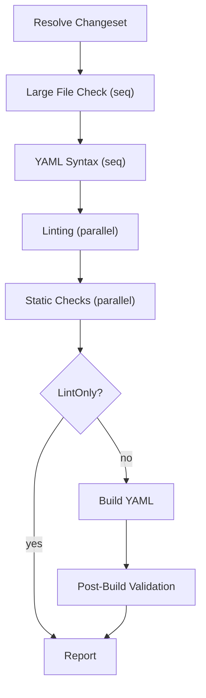

# CI Pipeline

This document describes what `k8s-gitops-ci pipeline`/`ci` (and the
standalone subcommands) actually do today. See
[ARCHITECTURE.md](ARCHITECTURE.md) for the one-paragraph overview and
package map; this is the detailed, step-by-step reference.

## Pipeline flow

`pkg/validator/phases.go`'s `RunAll` runs four or six phases, in order:

- **Large File Check** and **YAML Syntax** each run as their own standalone,
  sequential phase (single check, no goroutine fan-out needed) before
  Linting - matching a downstream fork's equivalent phase breakdown (see
  the timing-table example in [DEVELOPMENT.md](DEVELOPMENT.md)). Both still
  feed the same `Section`/PR-comment rendering as every other Static Checks
  sub-check (`ComposeStaticChecksSection`'s fixed 5-check order) - only the
  live console/timing-table grouping differs.
- **Linting** and **Static Checks** (the remaining config-sort/startingCSV/
  scaffold-table checks) each fan every one of their steps out across
  goroutines (bounded by `Workers(opts)` — see [Concurrency](#concurrency)
  below) rather than running sequentially; every step still gets recorded
  (pass/fail/skip) in the report even when it found nothing wrong, so a
  linter never silently disappears from the output.
- **Build YAML** and **Post-Build Validation** together only run unless
  `--lint-only` is passed. Build YAML resolves the affected overlay set
  (`detectOverlaysForChanges` — see [ARCHITECTURE.md](ARCHITECTURE.md)),
  runs Scaffold Validation, and builds every overlay (via a bounded
  per-overlay worker pool, plus a per-app "Building: `<name>`" console
  summary banner printed once all of that app's overlays finish building).
  Post-Build Validation then runs the doc-scoped and overlay-scoped checks
  (see [Registered Checks](#registered-checks) below - the overlay-scoped
  pass itself actually executes inside Build YAML's worker-pool loop,
  alongside the build, since neither depends on the other's result within
  one overlay's iteration), Kyverno, and NAD validation, and classifies
  every finding as blocking (direct) or warning-only (external) — see
  [Direct vs. external findings](#direct-vs-external-findings).

## Modes

| Mode                  | Command                                                            | Changeset source                                                                                                                                                                                                                                                                                                                                                                                                |
| --------------------- | ------------------------------------------------------------------ | --------------------------------------------------------------------------------------------------------------------------------------------------------------------------------------------------------------------------------------------------------------------------------------------------------------------------------------------------------------------------------------------------------------- |
| Full pipeline         | `k8s-gitops-ci pipeline --url <repo> --pr <n>` (alias: `ci`)       | PR's changed files via the GitHub API                                                                                                                                                                                                                                                                                                                                                                           |
| Local PR check        | `k8s-gitops-ci pipeline --revision <sha> --target-branch <branch>` | `git diff <target>...<revision>`                                                                                                                                                                                                                                                                                                                                                                                |
| Working-tree scan     | `k8s-gitops-ci test-all [dirs...]`                                 | every file under the given positional directories (not a diff — the full tree under each path); with no positional dirs, falls back to the same changeset resolution as `pipeline` (see below)                                                                                                                                                                                                                  |
| Uncommitted-diff scan | `k8s-gitops-ci scan-all`                                           | **`git diff` + `git diff --cached`** in the current working tree — despite the name, this does **not** scan every file in the repository; it only sees uncommitted changes, since it passes no `--dirs`/`--url`/`--pr`/`--revision` and `resolveChangeset` falls back to a working-tree diff when none of those are set. To validate the _entire_ repository regardless of git state, use `test-all .` instead. |
| Ad-hoc overlay build  | `k8s-gitops-ci build-yaml --app <app> --cluster <cluster>`         | Targeted, git-independent: the given app(s)/cluster(s)' `base/` + matching `overlays/<cluster>` directories only — see `--app`/`--cluster` below.                                                                                                                                                                                                                                                               |

`test-all` and `scan-all` accept the same changeset-scoping and
check-enablement flags as `pipeline` — `--url`/`--pr`/`--target-branch`
(PR/diff source), `--dirs` (restricts the resolved changeset to path
prefixes — a filter, distinct from `test-all`'s positional `[dirs...]`,
which instead _replaces_ the changeset source with a full-tree walk),
`--disable-checks`/`--enable-checks`, `--hook-source`, `--concurrency`,
`--assume-openshift`, and `--app`/`--cluster` (below). This lets a
failing `pipeline --url ... --pr ...` run be reproduced locally with
`test-all`/`scan-all` using an equivalent flag set, and vice versa.

`--lint-only` (pipeline mode only) skips the Build Overlays + Resource
Compliance phase entirely — useful for a fast Linting/Static-Checks-only
pass.

**`--app`/`--cluster` targeting** (`Options.Apps`/`Options.Clusters`,
repeatable flags) is resolved by `resolveTargetOverlays`
(`pkg/validator/target_wiring.go`) and takes priority over every other
changeset source (`Dirs`, diff-based resolution) when either is set —
entirely independent of git history/diffing, unlike every other mode:

- Both given: every `(app, cluster)` combination whose
  `overlays/<cluster>` directory actually exists on disk, plus that
  app's `base/`. A combination that doesn't exist on disk is silently
  skipped (not an error) so one typo in a multi-app/-cluster invocation
  doesn't abort the whole run; an app with none of the given clusters
  is skipped entirely.
- `--app` only: that app's entire directory (`base/` + every overlay).
- `--cluster` only: every app discovered in the repository (via
  `changeset.GetAllFiles` + the same app-root detection kubeconform
  validation uses) that has an `overlays/<cluster>` directory for one
  of the given cluster names.

An error is returned only if nothing resolves to anything on disk at
all (every value was a typo, or no app in the repo has a matching
cluster) — a silently-empty, always-passing run would be more
surprising than a hard failure here. (`pkg/scaffold.Run` takes its own,
unrelated per-app `RunOptions.App` — see
[Scaffold Validation](#scaffold-validation) below — driven entirely by
the resolved changeset, not `Options.Apps`/`Clusters`, so it's
unaffected either way.)

## Build Strategies

`pkg/validator/phases.go`'s Build YAML phase picks a
`pkg/overlay.Strategy` per app (`overlay.DetectStrategy`, wired via
`resolveAppBuildStrategies` in `pkg/validator/avp_wiring.go`) before
rendering any of that app's overlays:

- A `base/kustomization.yaml` → Kustomize, via the native Kustomize SDK
  (`sigs.k8s.io/kustomize/api/krusty`) — no runtime dependency on a
  `kustomize` binary. A `Chart.yaml` alongside it is still built via
  Kustomize (consumed through its own `helmCharts` inflator).
- No `kustomization.yaml` but a `base/Chart.yaml` → Helm, via the native
  chart loader + rendering engine (`helm.sh/helm/v3/pkg/...`) — no
  runtime dependency on a `helm` binary either, mirroring what
  `helm template` produces.
- Either way, if `DetectStrategy` finds an AVP indicator anywhere under
  the app (a direct `argocd-vault-plugin` reference, an
  `avp.kubernetes.io` annotation, or a `<path:...>`/`<vault:...>`/
  `<aws:...>`/`<gcp:...>` placeholder — see
  `overlay.AppHasAVPIndicators`), that overlay's rendered output is
  additionally piped through `argocd-vault-plugin generate -`, resolving
  those placeholders the way ArgoCD's real AVP plugin does at sync time
  — unless the overlay's basename is listed in that app's `test.sh`
  `AVP_EXCLUDE=` (`hook.Config.AVPExclude`, now actually read - see
  [HOOKS.md](HOOKS.md)).

The **`avp`** step ID (default **on**, same generic enable/disable
mechanism as every other step - see `Options.DisabledChecks`'s doc
comment) gates this entirely: `--disable-checks avp` forces every app's
Strategy back to plain Kustomize/Helm regardless of any AVP indicator
found, for an operator running without the `argocd-vault-plugin` binary
or a configured secret backend.

Every real caller that needs a fully-rendered overlay - this phase's
build-error detection (`pkg/validator/hook_wiring.go`'s
`buildOverlayWithHooks`) - goes through this strategy-aware path
(`overlay.RenderWithStrategy`). Two callers deliberately still render
Kustomize-only, unconditionally, via `overlay.RenderKustomize` directly:
`pkg/validator/kubeconform_overlay.go`'s schema validation over rendered
overlays (runs during the earlier Linting phase, before any app's
`test.sh`/strategy is resolved) and `pkg/ghostpatch/ghostpatch.go`'s
patch-vs-base drift detection (structural, unaffected by secret
placeholders either way). Don't be misled by the `placeholder` check's
AVP-pattern recognition (`<path:...>` etc. are real regexes in
`pkg/validator/placeholder`) into assuming _that_ check resolves
anything - it only _detects_ unresolved AVP tokens in
already-rendered/committed YAML, independent of the build-time
resolution described above.

## Ghost Patch Detection

Part of the Kustomize Build report section, `pkg/ghostpatch` detects a
"ghost patch" - a `kustomization.yaml` `patches` entry whose `target`
(kind/name/namespace) doesn't match any resource actually present in that
overlay's rendered output, almost always because the resource it was meant
to patch was renamed or removed elsewhere without updating (or removing)
the patch. Every detected ghost is always shown in the report's Ghost
Patches table, but only some are **blocking**
(`ghostpatch.ClassifyOverlay`/`ClassifyApp`, wired via
`buildGhostTable` in `pkg/validator/build_wiring.go`):

- **Blocking** - the `kustomization.yaml`'s `patches:` section itself
  changed relative to `main`/`origin/main` (via a real `git show` diff,
  `ghostpatch.PatchesSectionChanged`) **and** the file isn't itself newly
  added in this PR (per the changeset's added-files list, resolved once
  via `changeset.GetAddedFiles` in `runBuildAndPostBuild`). This is the
  case this PR most likely introduced or should have caught.
- **Warning-only** - either the ghost patch predates this PR (the
  `patches:` section is unchanged from `main`) or the `kustomization.yaml`
  is brand new in this PR (nothing to compare against yet, so it can't
  be confidently attributed to a change this PR made).

A failure to resolve `main`/`origin/main` (no git history available, e.g.
a shallow clone) degrades to "unchanged" (never blocking) rather than
failing the check outright.

The Kustomize Build section's own "Ghost Patches" line mirrors this split:
❌ (and the section fails) only when at least one detected ghost is
blocking; a table with warning-only ghosts alone shows ⚠️ without failing
the section - the same ❌-blocking/⚠️-warning-only convention used by the
"Pre-Existing Scaffold Drift" and Resource Compliance sections elsewhere
in this report.

## Scaffold Validation

Apps that opt into `scafctl`-based scaffolding (a `.scafctl/configs/<app>.yaml`
config exists - unrelated apps are skipped entirely, not treated as an
error) are re-validated against their scaffold template/config whenever a
change could affect their generated content
(`pkg/validator/scaffold_wiring.go`'s `runScaffoldValidation`, called from
the Build YAML phase). Three independent triggers, each skipping
any app an earlier one already tested, cover every way a change can
require this:

1. **Template changes** (`configdiff.DetectTemplateChanges`) - a shared
   template changed, so every overlay of every app using it is
   re-checked (a full test).
2. **Config changes** (`configdiff.DetectAffectedApps`) - either specific
   clusters (an override changed) or a full test (a change that fans out
   cluster-independently, e.g. a changeGroup reassignment - see
   `provider.Providers.ChangeGroups`).
3. **An app's own overlay files changed**, not already covered above -
   only the overlays the PR actually touched, using the same trigger
   classification `overlay.GetOverlaysToTest` uses for the build phase
   itself.

For each app, `pkg/scaffold.Run` regenerates its overlays via scafctl once
(bounded by a 2-minute timeout) and diffs the result against every
overlay actually being checked, **bounded-parallel** (up to
`runtime.NumCPU()*2` overlays at once - the per-app fan-out above is
similarly bounded-parallel across apps). An overlay is skipped rather
than failed when it's disabled - either explicitly
(`scaffoldDisabled: [...]` in the app's own scafctl config - see
`scaffold.IsOverlayDisabled`) or via change-group 0
(`scaffold.IsChangeGroupDisabled`) - or has no on-disk directory at all
(a cluster not yet rolled out, or removed by this PR;
`scaffold.Summary.SkippedClusters`, aggregated per app by
`runScaffoldValidation` and flattened by `flattenSkippedClusters` into the
Scaffold Validation section's "Missing Clusters" bullet). A scafctl
execution failure is always treated as blocking. A content mismatch is
blocking when the PR itself touches the affected overlay (or a base/
component it inherits from - `isOverlayRelatedToChangedFiles`); otherwise
it's checked against the merge-base template/config
(`computeBaselineMismatches`, gated on `Options.BaseRef` being set - i.e.
an actual CI/PR run, never a local `test-all` run against a live working
tree, which always has an empty `BaseRef`) and downgraded to a
non-blocking "Pre-Existing Scaffold Drift" entry when it mismatches there
too - this accounts for drift caused by something external to the PR
(e.g. a shared data source changing independently) rather than by the
PR's own edits. `computeBaselineMismatches` mutates the app's on-disk
template/config files in place for the duration of the re-run (backed up
and restored via `defer`, so a panic mid-run can never leave the working
tree altered) - a real but substantially riskier technique than a flat
"any drift blocks" policy, which is why it's reserved for exactly the
case it exists to fix rather than applied unconditionally. Missing
clusters themselves are **not** blocking, unlike drift/exec failures - a
skip is an expected, informational "here's what wasn't checked and why",
never a finding (see `scaffold.Run`'s own doc comment).

Separately, every app whose overlays or `.scafctl` template/config
changed is also checked for whether it has drift **coverage** at all:
`findUnprotectedApps` (`pkg/validator/scaffold_wiring.go`) flags any app
that has a scaffold template (so drift detection is actually available
for it) but has opted out via `SCAFFOLD=false` in its `test.sh` (see
[HOOKS.md](HOOKS.md)) - these apps are silently skipped by every trigger
above (`scaffold.HasScaffoldEnabled` gates all three), so a real drift
there would otherwise go completely unreported. This renders as its own
"Scaffold Drift Protection" report section, always present,
non-blocking (a coverage gap warning, not a drift finding).

Separately, `scaffold.CheckReadmeStatus` is a cheap, structural,
per-PR check of the README's `<!-- scaffold-status -->` table: does it
list exactly the (app, overlay) pairs that exist on disk today, with no
missing or stale rows? It does **not** recompute actual drift (that
would mean scaffolding every app in the repo on every PR, not just the
ones it touched) - that's `scaffold.UpdateReadmeStatus`'s job instead,
a full-repo-scan regeneration meant to be run deliberately (the
`update-scaffold-status` CLI command), not on every PR. Unlike the
three drift triggers above, this check is gated behind the
**`scaffold-readme`** step ID, default **off** - see the standalone
steps list below for why. It runs as its own **"scaffold table"**
sub-check in the **Static Checks** section (not folded into Scaffold
Validation's drift summary), so a failure automatically gets an
actionable `k8s-gitops-ci update-scaffold-status` fix-command hint the
same way `config-sort`/`prettier`/`markdownlint` do (`hintByCheck` in
`comments.go`).

## Registered checks

Every check below is registered via `check.Register` in
`pkg/validator/register_checks.go` and, by that registration alone,
automatically exemptable via its own check ID (see
[EXCEPTIONS.md](EXCEPTIONS.md)) unless noted otherwise.

| ID                 | Package                     | Scope   | What it checks                                                                                                                                                                                                                                                                                                                                                                                                                                        |
| ------------------ | --------------------------- | ------- | ----------------------------------------------------------------------------------------------------------------------------------------------------------------------------------------------------------------------------------------------------------------------------------------------------------------------------------------------------------------------------------------------------------------------------------------------------- |
| `namespace`        | `pkg/validator/namespace`   | Doc     | Namespace-scoped resources declare `metadata.namespace`; cluster-scoped resources don't (except build-time-only Kustomize control objects)                                                                                                                                                                                                                                                                                                            |
| `psa-labels`       | `pkg/validator/psa`         | Doc     | Pod Security Admission namespace labels                                                                                                                                                                                                                                                                                                                                                                                                               |
| `rbac-readonly`    | `pkg/validator/rbac`        | Doc     | A `ClusterRole` carrying an aggregate-to-view/cluster-reader label only grants read-only verbs (with a narrow, exact-match allowlist for a handful of known exceptions)                                                                                                                                                                                                                                                                               |
| `rbac-wildcards`   | `pkg/validator/rbac`        | Doc     | No `"*"` in `verbs`/`resources`/`apiGroups` on `Role`/`ClusterRole`                                                                                                                                                                                                                                                                                                                                                                                   |
| `crb`              | `pkg/validator/crb`         | Doc     | `ClusterRoleBinding` subject namespace sanity                                                                                                                                                                                                                                                                                                                                                                                                         |
| `sync-options`     | `pkg/validator/syncopts`    | Doc     | Non-builtin API-group resources carry the ArgoCD `SkipDryRunOnMissingResource=true` sync-options annotation (builtin/core groups and OpenShift/OKD-exclusive API groups — e.g. `route.openshift.io`, `config.openshift.io` — are always exempt; OpenShift-_default_-but-portable groups that also ship on non-OpenShift clusters — e.g. Prometheus Operator, OLM, Gateway API, Multus/OVN-Kubernetes CNI — are only exempt with `--assume-openshift`) |
| `image-checksum`   | `pkg/validator/image`       | Doc     | Every OCI image reference is pinned to a `sha256:` digest, not just a tag                                                                                                                                                                                                                                                                                                                                                                             |
| `named-ports`      | `pkg/validator/namedport`   | Doc     | Container/Service ports are named, not numeric, everywhere they're referenced                                                                                                                                                                                                                                                                                                                                                                         |
| `podspec-defaults` | `pkg/validator/podspec`     | Doc     | Required pod-level fields (`enableServiceLinks`, `restartPolicy`, ...) and container `securityContext`/`resources.requests`/`resources.limits` are all set                                                                                                                                                                                                                                                                                            |
| `placeholder`      | `pkg/validator/placeholder` | Doc     | No unresolved `<PLACEHOLDER>`-style tokens, AVP secret-reference tokens, or sentinel words (`CHANGEME`, `FIXME`, `XXX`, ...) left in committed YAML                                                                                                                                                                                                                                                                                                   |
| `cluster-identity` | `pkg/validator/clusterid`   | Overlay | No copy/paste of another cluster's identity (cluster name, project ref) into this overlay — see `exempt.IDClusterName`/`IDProjectRef` (exemptable) vs. `exempt.IDClusterIdentity` (a deliberately non-exemptable structural bucket for findings that don't set a more specific ID)                                                                                                                                                                    |

`cluster-identity` is disabled entirely (produces no findings at all,
including its infraID-mismatch/invalid-JSON structural findings, which
don't otherwise depend on any configured metadata) unless an org supplies
a `provider.Providers.ClusterMetadata` implementation whose
`ProjectIdentity()` reports itself enabled - `RunAll` bridges it into
`validator.ClusterIndexProvider` once per run
(`configureClusterIdentityFromProviders`, `pkg/validator/register_checks.go`).
A generic run with no such provider wired never sees a cluster-identity
finding.

A handful of documents/directories are excluded from the doc-check pass
above entirely (not merely exempted — they never generate a finding to
begin with):

- Every Kyverno `ClusterPolicy`/`Policy` document (`isKyvernoPolicyDoc`,
  `pkg/validator/dispatch.go`) is excluded from every registered doc
  check, since a policy's rule body can be shaped like a bare Pod/Service
  spec (to match against), which would otherwise trip
  `podspec-defaults`/`psa-labels`/`named-ports`/etc.
- Any directory containing a `kyverno-test.yaml` (a Kyverno CLI test
  manifest) has all of its files excluded from the doc-check pass
  (`filterKyvernoTestFixtureDirs`, `pkg/validator/engine.go`) — those
  fixtures are deliberately non-compliant by design (e.g. a Pod missing a
  required field, to exercise a policy's "should fail" case) and aren't
  real workloads. This doesn't affect kubeconform/Kyverno validation
  themselves, which run over the changeset independently.
- `placeholder` skips `CustomResourceDefinition` documents
  (`placeholderCheck.SkipDoc`, `pkg/validator/register_checks.go`) — a
  CRD's embedded OpenAPI schema can legitimately contain
  angle-bracket/sentinel-shaped tokens (defaults, examples, pattern
  strings) that aren't unresolved secrets.
- `psa-labels` findings are suppressed when every one of that finding's
  missing labels is present, commented out, in the app's `base/`
  (`filterCommentedPSAFindings`, `pkg/validator/psa_wiring.go`) — e.g. an
  operator temporarily commented a label out while troubleshooting. A
  label that's present with an _invalid_ value is never suppressed this
  way, only one that's genuinely absent.

Four standalone (non-registry) steps participate in the same
enable/disable ID mechanism (see `docs/DEVELOPMENT.md`'s
[Generic check-enablement mechanism](DEVELOPMENT.md#generic-check-enablement-mechanism)):

- **`golangci`** — Go linting via `pkg/lint/golangci`, default **on**.
- **`avp`** — per-app AVP strategy auto-detection (see
  [Build Strategies](#build-strategies) above), default **on**.
- **`scaffold-readme`** — the README scaffold-status table structural
  check (see [Scaffold Validation](#scaffold-validation) above), default
  **off**. Like `kyverno` below, this generic core can't know whether a
  given repo's table actually matches the one-row-per-app-per-overlay
  shape the check expects, so it's opt-in
  (`--enable-checks scaffold-readme`) until an org confirms
  compatibility - the other three scaffold-drift triggers
  (template/config/overlay changes) are unaffected and always run.
- **`kyverno`** — policy validation via `pkg/lint/kyverno`, default
  **off** (an org must opt in and supply its own policies — see
  [SCHEMAS.md](SCHEMAS.md)). Once enabled (`--enable-checks kyverno`),
  every successfully-built overlay from this phase's build loop (see
  [Build Strategies](#build-strategies) above) **plus every raw changed
  YAML source file** (excluding `kustomization.yaml`/`.yml`/
  `Kustomization` files, which aren't real resources) is batched into one
  `kyverno apply` invocation
  (`pkg/validator/kyverno_wiring.go`'s `runKyvernoValidation`) against the
  prepared policy bundle. The raw-source pass exists because a brand new
  component not yet referenced by any overlay's `kustomization.yaml`
  never appears in any rendered overlay output at all, so relying on
  rendered output alone would let a policy violation in it go completely
  unnoticed until it's actually wired up; some overlap between the two
  passes is expected and harmless. Results render as a non-blocking
  "Kyverno Policies" advisory section (`kyverno.FormatComment`'s own doc
  comment: findings never contribute to `res.Blocking`, regardless of
  which pass found them). A missing `kyverno`/`kustomize` CLI,
  unpreparable policies, or a write failure all degrade to an empty
  section rather than failing the run - Kyverno support is
  opt-in and best-effort once enabled, not a hard CI dependency.

## NetworkAttachmentDefinition (NAD) validation

`pkg/validator/nad` validates every successfully-rendered overlay's
`NetworkAttachmentDefinition` resources (`runNADValidation` in
`pkg/validator/nad_wiring.go`, over the same batch of rendered overlay
output the `kyverno` step consumes — see
[Build Strategies](#build-strategies)). Unlike the checks in the table
above, it is **not** part of the `check.Register` framework: it's always
on (not gateable via `DisabledChecks`/`EnabledChecks`) and its findings
are **not** exemptable via `EXEMPTIONS=(...)` or the
`gitops-ci.k8s.io/exempt-<check-id>` annotation (see
[EXCEPTIONS.md](EXCEPTIONS.md)). It renders as its own
"NetworkAttachmentDefinition Validation" report section, blocking on any
finding. The section is **omit-when-absent** (like the opt-in Kyverno
section): it's rendered only when at least one
`NetworkAttachmentDefinition` is actually present in the rendered-overlay
chain, showing the result whether it passed or failed — a changeset that
touches no NAD gets no section rather than an empty "0 NADs, all good"
stub. The validator itself still always runs; only the (empty) section is
suppressed.

It has two tiers:

- **Structural** (always on): the resource is a
  `NetworkAttachmentDefinition` and its `spec.config` field is present
  and non-empty. CNI-neutral — no assumption about which CNI the config
  targets.
- **OVN-Kubernetes-aware** (opt-in via `--assume-openshift`, i.e.
  `Options.AssumeOpenShift` — the same flag that exempts OpenShift-only
  API groups from `sync-options` above, since an OpenShift/OKD cluster's
  default CNI is OVN-Kubernetes): parses `spec.config` as an OVN netconf
  and applies OVN's semantic rules (topology/role/subnet/transport
  constraints, ported from `ovn-kubernetes/util.ValidateNetConf` — see
  `pkg/validator/nad`'s package doc comment for what's intentionally
  omitted: runtime-only checks that depend on live cluster state).

`validate-nad` also exposes this directly as a CLI subcommand, bypassing
the full pipeline, for validating a directory or explicit file list
(`k8s-gitops-ci validate-nad [--assume-openshift] --dir <path>` or
`... <file.yaml> ...`).

## Linting phase (all steps run concurrently)

- **markdownlint**, **prettier**, **golangci** (Go files only),
  **kubeconform** (schema-validates changed YAML plus every affected
  overlay's _rendered_ output, not just the raw source) — each wraps its
  underlying CLI/library and degrades gracefully (skips, doesn't fail)
  when the tool isn't installed.
- **shellcheck** — wraps the raw `shellcheck` CLI over changed `.sh`/
  `.bash` files (or any file whose shebang matches), **plus** extracts
  and lints:

  - Bash steps embedded in Tekton `Task` manifests
    (`spec.steps[].script`, `pkg/lint/shellcheck/tekton.go`).
  - Bash embedded in workload container/initContainer `command` fields
    (`[bash|sh, -c, <script>]` form) and ConfigMap `.sh`/`.bash` data
    keys (`pkg/lint/shellcheck/embedded.go`), across
    `Pod`/`Job`/`CronJob`/`Deployment`/`DaemonSet`/`StatefulSet`/
    `ReplicaSet` (`CronJob`'s pod spec is nested three levels deeper than
    every other kind, handled the same way `namedport`/`podspec` handle
    it). Non-bash scripts (python, plain `sh`, no shebang) are silently
    skipped — shellcheck only understands bash/sh/dash/ksh.

  Extracted-script findings are classified **direct/blocking** (the
  script's source YAML file was itself changed in this diff) vs.
  **external/warning-only** (the file was only pulled into scope because
  the overlay it lives in was affected by an unrelated base/component
  change elsewhere), reusing the exact same file-set logic
  (`externalOverlayYAMLFiles`, a directory walk over every overlay
  `detectOverlaysForChanges` resolves, excluding files already in the
  diff) as the identical direct/indirect split `finalizeCompliance`
  applies to Resource Compliance findings. Raw `.sh` file findings are
  always direct — they're literally files in the diff.

## Static Checks phase (all steps run concurrently)

- **large-file** — flags files over a size threshold
  (`pkg/largefile.DefaultMaxSize`), or that look binary. A generic
  ignore-glob allowlist (`pkg/largefile.DefaultIgnorePatterns` — compressed
  archives, web fonts, images/icons, and `customresourcedefinition*.yaml`,
  whose embedded OpenAPI schemas legitimately run large) is applied by
  default; override the var to add/replace entries.
- **YAML-syntax** — parse-level YAML validity (`pkg/lint/yamlsyntax`),
  independent of and cheaper than schema validation.
- **config-sort** — repo config files are alphabetically sorted
  (`pkg/config.CheckSortOrder`).
- **startingCSV** — an OLM `ClusterServiceVersion`'s folder name matches
  its `startingCSV` reference (`pkg/csv`).
- **scaffold table** — the README's `<!-- scaffold-status -->` table
  structural check (`scaffold.CheckReadmeStatus`; see
  [Scaffold Validation](#scaffold-validation) above). Gated behind the
  **`scaffold-readme`** step ID, default **off**.

## Direct vs. external findings

Every Resource Compliance finding (and, as of the shellcheck extraction
work above, every extracted-script finding too) is classified by
`finalizeCompliance`/its shellcheck-step equivalent using one rule: was
the finding's source file itself part of this changeset's diff? If yes,
it's **direct** (❌, blocking — the author touched this file). If the
file wasn't changed but was pulled into scope only because a shared
base/component the affected overlay depends on changed elsewhere, it's
**external** (⚠️, warning-only, non-blocking) — an issue you didn't
introduce and shouldn't be blocked by fixing right now.

## Concurrency

`Workers(opts)` returns `opts.Concurrency` if set (`--concurrency`), else
`runtime.NumCPU() * 2`. This bounds:

- The Linting/Static-Checks goroutine fan-out (one goroutine per step,
  not pooled — there are only ~9 steps total, so no pool is needed).
- The per-overlay worker pool in the Build YAML phase (capped at
  `min(Workers(opts), len(overlays))`, so a small changeset never
  over-allocates goroutines for a handful of overlays).

`pkg/validator/timing.go`'s `TimingCollector` records both a
parallelism-efficiency ratio and the resolved concurrency in the final
timing table — see `docs/DEVELOPMENT.md`'s
[Timing table](DEVELOPMENT.md#timing-table-pkgvalidatortimingg) section
for the exact rendering. (This repo has no per-document content-dedup/
hashing layer to describe here — every changed/affected file is checked
independently, once.)

## Report structure

See `docs/DEVELOPMENT.md`'s
[Unified PR-comment report](DEVELOPMENT.md#unified-pr-comment-report-pkgvalidatorunified_reportgo-compose_sectionsgo)
section for the full rendering model (sections, sub-check dropdowns,
status icons). In short: one PR comment, each top-level section a
collapsible `
` block - PR Checks, Linting, Static Checks,
Kustomize Build, Scaffold Validation, Scaffold Drift Protection,
Resource Compliance, and CI Notes, plus NetworkAttachmentDefinition
Validation when a NAD is present in the rendered-overlay chain and Kyverno
Policies when the opt-in `kyverno` step is enabled (see
[Registered checks](#registered-checks) below). Resource Compliance
additionally groups findings by check ID with an "Accepted Exceptions"
audit sub-block.

Each check-ID group under Resource Compliance renders using that check's
registered `check.TableSpec` (`pkg/validator/register_tables.go`) when
one exists: its own descriptive title/preamble and columns (e.g.
`image-checksum` shows Kind/Name/Image/File, not just a flat File/
Message dump), with findings that are the same underlying issue fanned
out across multiple overlays/build locations collapsed into one row
listing every affected file (`dedupFindingsForTable` in
`compose_sections.go`) instead of repeating an otherwise-identical row
per location. A check id with no registered `TableSpec` still falls back
to the original generic two-column File/Message table.
