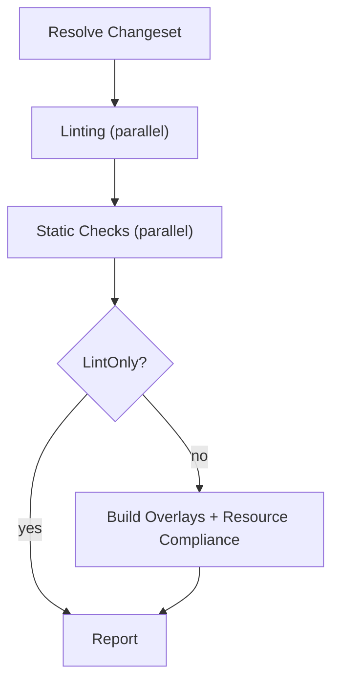

# CI Pipeline

This document describes what `k8s-gitops-ci pipeline`/`ci` (and the
standalone subcommands) actually do today. See
[ARCHITECTURE.md](ARCHITECTURE.md) for the one-paragraph overview and
package map; this is the detailed, step-by-step reference.

## Pipeline flow

`pkg/validator/phases.go`'s `RunAll` runs two or three phases, in order:

- **Linting** and **Static Checks** each fan every one of their steps out
  across goroutines (bounded by `Workers(opts)` — see
  [Concurrency](#concurrency) below) rather than running sequentially;
  every step still gets recorded (pass/fail/skip) in the report even when
  it found nothing wrong, so a linter never silently disappears from the
  output.
- **Build Overlays + Resource Compliance** only runs unless
  `--lint-only` is passed. It resolves the affected overlay set
  (`detectOverlaysForChanges` — see [ARCHITECTURE.md](ARCHITECTURE.md)),
  runs the doc-scoped and overlay-scoped checks (see
  [Registered Checks](#registered-checks) below) concurrently across a
  bounded worker pool, and classifies every finding as blocking
  (direct) or warning-only (external) — see
  [Direct vs. external findings](#direct-vs-external-findings).

## Modes

| Mode                  | Command                                                            | Changeset source                                                                                                                                                                                                                                                                                                                                                                                                |
| --------------------- | ------------------------------------------------------------------ | --------------------------------------------------------------------------------------------------------------------------------------------------------------------------------------------------------------------------------------------------------------------------------------------------------------------------------------------------------------------------------------------------------------- |
| Full pipeline         | `k8s-gitops-ci pipeline --url <repo> --pr <n>` (alias: `ci`)       | PR's changed files via the GitHub API                                                                                                                                                                                                                                                                                                                                                                           |
| Local PR check        | `k8s-gitops-ci pipeline --revision <sha> --target-branch <branch>` | `git diff <target>...<revision>`                                                                                                                                                                                                                                                                                                                                                                                |
| Working-tree scan     | `k8s-gitops-ci test-all [dirs...]`                                 | every file under the given directories (not a diff — the full tree under each path)                                                                                                                                                                                                                                                                                                                             |
| Uncommitted-diff scan | `k8s-gitops-ci scan-all`                                           | **`git diff` + `git diff --cached`** in the current working tree — despite the name, this does **not** scan every file in the repository; it only sees uncommitted changes, since it passes no `--dirs`/`--url`/`--pr`/`--revision` and `resolveChangeset` falls back to a working-tree diff when none of those are set. To validate the _entire_ repository regardless of git state, use `test-all .` instead. |
| Ad-hoc overlay build  | `k8s-gitops-ci build-yaml --app <app> --cluster <cluster>`         | Same fallback as `scan-all` (uncommitted working-tree diff) — see the known limitation immediately below.                                                                                                                                                                                                                                                                                                       |

`--lint-only` (pipeline mode only) skips the Build Overlays + Resource
Compliance phase entirely — useful for a fast Linting/Static-Checks-only
pass.

> **Known limitation — `--app`/`--cluster` are currently unwired.** > `Options.Apps`/`Options.Clusters` are threaded all the way from the
> `pipeline`/`build-yaml` CLI flags down to `validator.Options`, but as of
> this writing **nothing in `pkg/validator` reads either field** to scope
> the changeset or the overlay set — `resolveChangeset` only ever looks
> at `Dirs`/`RepoURL`/`PR`/`BaseRef`/`IncludeDeletions`. The one function
> that does consume an `Apps` list, `pkg/scaffold.Run` (`RunOptions.Apps`,
> a distinct struct from `validator.Options`), is itself never called
> from `pkg/validator/phases.go` or anywhere else in the real pipeline
> (only the no-argument `scaffold.CheckReadmeStatus()` is). Practically:
> `k8s-gitops-ci build-yaml --app foo --cluster bar` today behaves
> identically to `k8s-gitops-ci scan-all` (an uncommitted-working-tree-
> diff scan across the whole repo) — the `--app`/`--cluster` values are
> silently accepted and then have no effect. Verify against the current
> code before relying on app/cluster scoping actually narrowing a run.

## Build Strategies

Overlay rendering in the actually-wired pipeline path is
**Kustomize-only**: `overlay.RenderKustomize` builds via the native
Kustomize SDK (`sigs.k8s.io/kustomize/api/krusty`), so there's no runtime
dependency on a `kustomize` binary. Every real caller
(`pkg/validator/build_wiring.go`'s build-error detection,
`pkg/validator/kubeconform_overlay.go`'s schema validation over rendered
overlays, `pkg/ghostpatch/ghostpatch.go`'s drift detection) calls this
function directly.

**Not yet wired:** `pkg/overlay.go` additionally implements a full
`BuildOptions`/`RunBuildLoop`/`Strategy` API supporting Helm chart
rendering and an `argocd-vault-plugin`-piped variant of both Kustomize
and Helm (`StrategyKustomizeAVP`/`StrategyHelmAVP` — shells out to
`argocd-vault-plugin generate -`, resolving `<path:...>`/`<vault:...>`/
`<aws:...>`/`<gcp:...>` placeholders the way ArgoCD's real AVP plugin
does at sync time). This code is real and unit-tested, but **no current
CLI flag or pipeline phase selects it** — there's no `--skip-avp` flag to
document because there's no AVP invocation path to skip in the first
place today. `hook.Config.AVPExclude` (parsed from the `test.sh`
contract's `AVP_EXCLUDE=` line — see [HOOKS.md](HOOKS.md)) is similarly
parsed but not read by anything outside `pkg/hook`. Don't be misled by
the `placeholder` check's AVP-pattern recognition (`<path:...>` etc. are
real regexes in `pkg/validator/placeholder`) into assuming the
resolution side is wired too — the check only _detects_ unresolved AVP
tokens in already-rendered/committed YAML, independent of whether
anything in this repo can _resolve_ them via a build step.

## Registered checks

Every check below is registered via `check.Register` in
`pkg/validator/register_checks.go` and, by that registration alone,
automatically exemptable via its own check ID (see
[EXCEPTIONS.md](EXCEPTIONS.md)) unless noted otherwise.

| ID                 | Package                     | Scope   | What it checks                                                                                                                                                                                                                                                                     |
| ------------------ | --------------------------- | ------- | ---------------------------------------------------------------------------------------------------------------------------------------------------------------------------------------------------------------------------------------------------------------------------------- |
| `namespace`        | `pkg/validator/namespace`   | Doc     | Namespace-scoped resources declare `metadata.namespace`; cluster-scoped resources don't (except build-time-only Kustomize control objects)                                                                                                                                         |
| `psa-labels`       | `pkg/validator/psa`         | Doc     | Pod Security Admission namespace labels                                                                                                                                                                                                                                            |
| `rbac-readonly`    | `pkg/validator/rbac`        | Doc     | A `ClusterRole` carrying an aggregate-to-view/cluster-reader label only grants read-only verbs (with a narrow, exact-match allowlist for a handful of known exceptions)                                                                                                            |
| `rbac-wildcards`   | `pkg/validator/rbac`        | Doc     | No `"*"` in `verbs`/`resources`/`apiGroups` on `Role`/`ClusterRole`                                                                                                                                                                                                                |
| `crb`              | `pkg/validator/crb`         | Doc     | `ClusterRoleBinding` subject namespace sanity                                                                                                                                                                                                                                      |
| `sync-options`     | `pkg/validator/syncopts`    | Doc     | Non-builtin API-group resources carry the ArgoCD `SkipDryRunOnMissingResource=true` sync-options annotation (builtin/core and, with `--assume-openshift`, OpenShift-only API groups are exempt)                                                                                    |
| `image-checksum`   | `pkg/validator/image`       | Doc     | Every OCI image reference is pinned to a `sha256:` digest, not just a tag                                                                                                                                                                                                          |
| `named-ports`      | `pkg/validator/namedport`   | Doc     | Container/Service ports are named, not numeric, everywhere they're referenced                                                                                                                                                                                                      |
| `podspec-defaults` | `pkg/validator/podspec`     | Doc     | Required pod-level fields (`enableServiceLinks`, `restartPolicy`, ...) and container `securityContext`/`resources.requests`/`resources.limits` are all set                                                                                                                         |
| `placeholder`      | `pkg/validator/placeholder` | Doc     | No unresolved `<PLACEHOLDER>`-style tokens, AVP secret-reference tokens, or sentinel words (`CHANGEME`, `FIXME`, `XXX`, ...) left in committed YAML                                                                                                                                |
| `cluster-identity` | `pkg/validator/clusterid`   | Overlay | No copy/paste of another cluster's identity (cluster name, project ref) into this overlay — see `exempt.IDClusterName`/`IDProjectRef` (exemptable) vs. `exempt.IDClusterIdentity` (a deliberately non-exemptable structural bucket for findings that don't set a more specific ID) |

Two standalone (non-registry) steps participate in the same
enable/disable ID mechanism (see `docs/DEVELOPMENT.md`'s
[Generic check-enablement mechanism](DEVELOPMENT.md#generic-check-enablement-mechanism)):

- **`golangci`** — Go linting via `pkg/lint/golangci`, default **on**.
- **`kyverno`** — policy validation via `pkg/lint/kyverno`, default
  **off** (an org must opt in and supply its own policies — see
  [SCHEMAS.md](SCHEMAS.md)). **Known limitation:** `stepKyverno` is
  registered in `defaultOffSteps` and documented as an opt-in step, but
  as of this writing `pkg/lint/kyverno` is never actually imported by
  `pkg/validator/phases.go` or any other pipeline call site — there is no
  dispatch wiring yet, so enabling it via `--enable-checks kyverno` is
  currently a no-op. Verify against the current code before relying on
  this changing without notice; treat Kyverno support as "the package
  exists and is independently tested, the pipeline integration doesn't
  yet."

## Linting phase (all steps run concurrently)

- **markdownlint**, **prettier**, **golangci** (Go files only),
  **kubeconform** (schema-validates changed YAML plus every affected
  overlay's _rendered_ output, not just the raw source) — each wraps its
  underlying CLI/library and degrades gracefully (skips, doesn't fail)
  when the tool isn't installed.
- **shellcheck** — wraps the raw `shellcheck` CLI over changed `.sh`/
  `.bash` files (or any file whose shebang matches), **plus** extracts
  and lints:

  - Bash steps embedded in Tekton `Task` manifests
    (`spec.steps[].script`, `pkg/lint/shellcheck/tekton.go`).
  - Bash embedded in workload container/initContainer `command` fields
    (`[bash|sh, -c, <script>]` form) and ConfigMap `.sh`/`.bash` data
    keys (`pkg/lint/shellcheck/embedded.go`), across
    `Pod`/`Job`/`CronJob`/`Deployment`/`DaemonSet`/`StatefulSet`/
    `ReplicaSet` (`CronJob`'s pod spec is nested three levels deeper than
    every other kind, handled the same way `namedport`/`podspec` handle
    it). Non-bash scripts (python, plain `sh`, no shebang) are silently
    skipped — shellcheck only understands bash/sh/dash/ksh.

  Extracted-script findings are classified **direct/blocking** (the
  script's source YAML file was itself changed in this diff) vs.
  **external/warning-only** (the file was only pulled into scope because
  the overlay it lives in was affected by an unrelated base/component
  change elsewhere), reusing the exact same file-set logic
  (`externalOverlayYAMLFiles`, a directory walk over every overlay
  `detectOverlaysForChanges` resolves, excluding files already in the
  diff) as the identical direct/indirect split `finalizeCompliance`
  applies to Resource Compliance findings. Raw `.sh` file findings are
  always direct — they're literally files in the diff.

## Static Checks phase (all steps run concurrently)

- **large-file** — flags files over a size threshold
  (`pkg/largefile.DefaultMaxSize`).
- **YAML-syntax** — parse-level YAML validity (`pkg/lint/yamlsyntax`),
  independent of and cheaper than schema validation.
- **config-sort** — repo config files are alphabetically sorted
  (`pkg/config.CheckSortOrder`).
- **startingCSV** — an OLM `ClusterServiceVersion`'s folder name matches
  its `startingCSV` reference (`pkg/csv`).

## Direct vs. external findings

Every Resource Compliance finding (and, as of the shellcheck extraction
work above, every extracted-script finding too) is classified by
`finalizeCompliance`/its shellcheck-step equivalent using one rule: was
the finding's source file itself part of this changeset's diff? If yes,
it's **direct** (❌, blocking — the author touched this file). If the
file wasn't changed but was pulled into scope only because a shared
base/component the affected overlay depends on changed elsewhere, it's
**external** (⚠️, warning-only, non-blocking) — an issue you didn't
introduce and shouldn't be blocked by fixing right now.

## Concurrency

`Workers(opts)` returns `opts.Concurrency` if set (`--concurrency`), else
`runtime.NumCPU() * 2`. This bounds:

- The Linting/Static-Checks goroutine fan-out (one goroutine per step,
  not pooled — there are only ~9 steps total, so no pool is needed).
- The per-overlay worker pool in the Build + Compliance phase (capped at
  `min(Workers(opts), len(overlays))`, so a small changeset never
  over-allocates goroutines for a handful of overlays).

`pkg/validator/timing.go`'s `TimingCollector` records both a
parallelism-efficiency ratio and the resolved concurrency in the final
timing table — see `docs/DEVELOPMENT.md`'s
[Timing table](DEVELOPMENT.md#timing-table-pkgvalidatortimingg) section
for the exact rendering. (This repo has no per-document content-dedup/
hashing layer to describe here — every changed/affected file is checked
independently, once.)

## Report structure

See `docs/DEVELOPMENT.md`'s
[Unified PR-comment report](DEVELOPMENT.md#unified-pr-comment-report-pkgvalidatorunified_reportgo-compose_sectionsgo)
section for the full rendering model (sections, sub-check dropdowns,
status icons). In short: one PR comment, five top-level sections
(Linting, Static Checks, Kustomize Build, Scaffold Validation, Resource
Compliance), each a collapsible `
` block; Resource Compliance
additionally groups findings by check ID with an "Accepted Exceptions"
audit sub-block.
